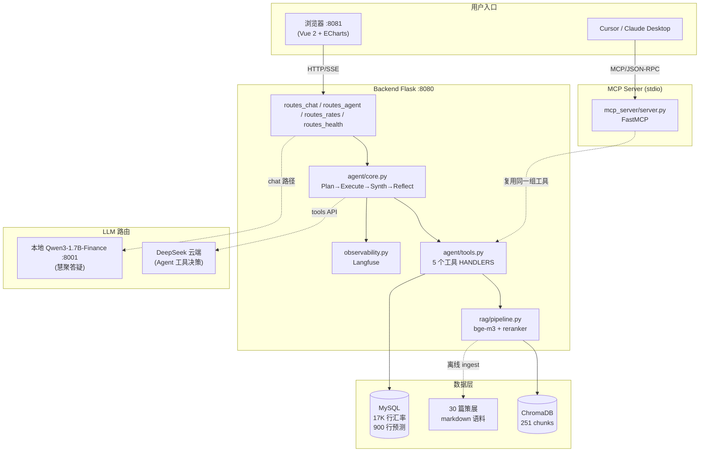
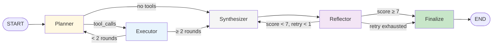

# CompassFXPulse

> 多币种外汇风险管理平台 — Function Calling Agent + RAG + MCP Server + LoRA 微调 + TimeXer 时序预测，端到端 LLM 应用工程实战。


---

## 这是什么

把 2025 年花旗杯参赛项目（Vue + Flask + LoRA 微调 + 多源爬虫）从"各模块脱节、demo 跑不起来"重构升级成 **生产级 LLM 应用栈**：

- 🤖 **Function Calling Agent**（LangGraph 状态机 + Reflector 反思纠错闭环）
- 📚 **RAG 检索栈**（bge-m3 嵌入 + bge-reranker-v2-m3 重排 + ChromaDB + 30 篇策展金融语料）
- 🔌 **MCP Server**（FastMCP，5 工具同步暴露给 Cursor / Claude Desktop）
- 🎯 **LoRA SFT**（Qwen3-1.7B + 自合成 200 条中文金融 Q&A，eval loss 4.85→1.30）
- 📈 **TimeXer 时序预测**（Transformer，25 年 ECB 长数据 + 4 套外生特征实验）
- 🔍 **Langfuse 全链路 Trace**（plan / tool / latency / token，可优雅降级）
- 💬 **异构 LLM 路由**（DeepSeek 云端处理 Agent，本地 LoRA 处理慧聚答疑，一行 `.env` 切换）

---

## 系统架构



## Agent 状态机（LangGraph）



---

## 关键交付指标

| 维度 | 数字 |
|---|---|
| **LoRA 微调** | Qwen3-1.7B QLoRA r=16，eval loss **4.85 → 1.30**（−73%），token 准确率 0.43→0.70 |
| **TimeXer backtest** | USD/GBP **MAE −10.23%** vs ARIMA（25 年 ECB + vol+mom+VIX+DXY） |
| **Agent 评测** | **30 题黄金集 pass 29/31=93.5%，LLM-as-Judge 平均 9.7/9.7/9.8（accuracy/faithfulness/helpfulness）** |
| **MCP Server** | 5 工具 + 1 resource，stdio + HTTP 双协议，3 PASS smoke test |
| **RAG 检索** | 30 篇策展语料 → 251 chunks，端到端检索 < 2s（含 reranker） |
| **数据规模** | 6 货币 × 25 年 = 7126 工作日，17,760 行汇率，900 行 SARIMAX 预测 |
| **代码规模** | ~189 文件 / 16 MB，覆盖 4 个工程方向（Web / Agent / 微调 / 时序） |

---

## 快速启动

> 假设已装 Python 3.12 + Node 16 + MySQL 8.x + 4 GB 显存的 GPU（CPU 也能跑，慢些）

### 1. 安装环境

```bash
conda create -n compass-fx python=3.12 -y
conda activate compass-fx
cd backend && pip install -r requirements.txt
```

### 2. 配置 `.env`

```bash
cd backend && cp .env.example .env
# 编辑 .env，至少填：
#   MYSQL_PASSWORD = 你的 MySQL root 密码
#   LLM_API_KEY    = 在 https://platform.deepseek.com/ 申请（充值 ¥10 够用一个月）
```

### 3. 初始化数据 + 索引

```bash
cd backend
mysql -u root -p < scripts/init_db.sql            # 建库 + 表
python scripts/refresh.py                          # 拉真实汇率 + 生成 SARIMAX 预测
python scripts/synthesize_corpus.py                # （可选）合成 30 篇 RAG 语料
python scripts/rebuild_rag.py --rebuild            # （可选）建向量库（需先下载 bge-m3）
```

### 4. 启动后端 + 前端

```bash
# 终端 1: 后端
python main.py
# 终端 2: 前端
cd frontend && npm install && npm run dev
# 浏览器 http://localhost:8081
```

### 5. （可选）接入 Claude Desktop / Cursor 的 MCP

参考 [`backend/mcp_server/README.md`](backend/mcp_server/README.md)，复制 [`claude_desktop_config.example.json`](backend/mcp_server/claude_desktop_config.example.json) 到 `%APPDATA%\Claude\claude_desktop_config.json`。

---

## 文档地图

每一个 phase 都有独立工程笔记 + 面试 Q&A：

| 阶段 | 文档 | 一句话总结 |
|---|---|---|
| 总览 | [docs/Phase3_总览.md](docs/Phase3_总览.md) | 5 个子阶段 + JD 覆盖矩阵 + 10 分钟 demo 路径 |
| 维护升级方案 | [docs/维护升级方案.md](docs/维护升级方案.md) | Phase 0-5 全规划（重启项目时的总图） |
| Phase 2 LoRA | [docs/Phase2_工程笔记.md](docs/Phase2_工程笔记.md) / [Phase2_完成报告.md](docs/Phase2_完成报告.md) | QLoRA 训练 + 自合成数据 + vLLM-style 部署 |
| Phase 2 三方对比 | [docs/LoRA_3way_comparison.md](docs/LoRA_3way_comparison.md) | DeepSeek vs Base Qwen3 vs LoRA 微调，8 题对比 |
| Phase 3.1+3.2 RAG | [docs/Phase3_RAG.md](docs/Phase3_RAG.md) | bge-m3 + reranker + ChromaDB + Agent 集成 |
| Phase 3.3 MCP | [docs/Phase3_3_MCP.md](docs/Phase3_3_MCP.md) | FastMCP + Cursor / Claude Desktop 接入 |
| Phase 3.4 Langfuse | [docs/Phase3_4_Langfuse.md](docs/Phase3_4_Langfuse.md) | 全链路 Trace + 优雅降级 |
| Phase 3.5 LangGraph | [docs/Phase3_5_LangGraph.md](docs/Phase3_5_LangGraph.md) | 多 Agent 状态机 + Reflector 反思 |
| **TimeXer backtest** | [docs/TimeXer_BacktestActuals.md](docs/TimeXer_BacktestActuals.md) | **8 个实验 + scaling experiment + 5 层面试 Q&A** |
| **Phase 4.1 缓存与并发** | [docs/Phase4_1_缓存与并发.md](docs/Phase4_1_缓存与并发.md) | **缓存层 + 连接池 + 限流，实测 ~6500× 提速** |
| **Phase 4.2 评测集** | [docs/Phase4_2_评测集.md](docs/Phase4_2_评测集.md) | **30 题 + LLM-as-Judge + 消融对照，pass 93.5% / judge 9.7** |
| **Phase 4.3 注入防御** | [docs/Phase4_3_注入防御.md](docs/Phase4_3_注入防御.md) | **5 层纵深防御 + 31 对抗样本，拦截率 96.8%** |

---

## 切换 LLM Provider

只改 `.env` 4 行，无需改代码：

| Provider | LLM_BASE_URL | LLM_MODEL |
|---|---|---|
| **DeepSeek**（默认） | `https://api.deepseek.com/v1` | `deepseek-chat` |
| 阿里云百炼（Qwen） | `https://dashscope.aliyuncs.com/compatible-mode/v1` | `qwen-plus` |
| 本地 Ollama | `http://127.0.0.1:11434/v1` | `qwen3:8b` |
| OpenAI | `https://api.openai.com/v1` | `gpt-4o-mini` |
| **本地 LoRA**（自训） | `http://127.0.0.1:8001/v1` | `qwen3-1.7b-finance` |

异构路由（Agent 走 DeepSeek，慧聚答疑走本地 LoRA）：分别填 `LLM_AGENT_*` 和 `LLM_CHAT_*`。

---

## 技术栈

```
后端       Flask 3.0 · MySQL 8 · OpenAI Python SDK · Langfuse 4.5
RAG        ChromaDB · bge-m3 · bge-reranker-v2-m3 · transformers 5.6
Agent      LangGraph 1.1 · LangChain Core 1.3 · DeepSeek tools API
MCP        mcp 1.27 (FastMCP)
微调       PyTorch 2.6 + cu124 · peft 0.19 · trl 1.3 · bitsandbytes 0.49
时序       statsmodels 0.14 (SARIMAX) · TimeXer (清华原版)
前端       Vue 2.5 · ElementUI 2.15 · ECharts 5 · Webpack 3 · Marked + DOMPurify
观测       Langfuse cloud / self-hosted
```

## 路线图

```
Phase 0  ✅  Web 应用救火 + DeepSeek 对接 + 真实数据回填
Phase 2  ✅  LoRA Qwen3-1.7B 金融领域 SFT + FastAPI 推理服务
Phase 3.1 ✅  RAG 检索栈（bge-m3 + reranker + ChromaDB + 30 策展语料）
Phase 3.2 ✅  Function Calling Agent（5 工具 + 三层防御 + Trace 可视化）
Phase 3.3 ✅  MCP Server（暴露给 Cursor / Claude Desktop）
Phase 3.4 ✅  Langfuse 全链路 Trace
Phase 3.5 ✅  LangGraph 多 Agent + Reflector 反思纠错闭环
Phase 4.1 ✅  缓存层（TTL/Redis 可切）+ 连接池 + 限流（QPS 5→50-100，缓存命中 ~6500× 提速）
Phase 4.2 ✅  30 题黄金集 + LLM-as-Judge + 消融对照（pass 29/31=93.5%，judge 平均 9.7/10）
Phase 4.3 ✅  Prompt 注入 5 层纵深防御 + 31 对抗样本（拦截率 30/31=96.8%）
Phase 4.4 📅  FastAPI 异步重写
Phase 4.5 📅  vLLM 部署本地 LoRA
Phase 4.6 📅  Skill 打包 (forex-pulse.skill)
```

---

## 致谢

- Phase 0 重构基于 2025 年花旗杯（CompassFXPulse）参赛项目源码
- 原项目设计：花旗杯参赛队
- 重构、Agent / RAG / MCP / LoRA 改造、TimeXer 实验：[xzzzzc217](https://github.com/xzzzzc217)（东南大学网络空间安全 / 2027 届）

## License

MIT — see [LICENSE](LICENSE).
