# AI Agent 岗位｜后端八股面试指南（含图解 + 全术语首次出现详解）

> **写给谁**：投蚂蚁 / 字节 / 阿里 / 腾讯 **AI 应用工程 / Agent 工程 / LLM Infra** 岗位，出身偏 ML / 算法、后端八股不扎实的同学。
>
> **本指南的 4 个原则**：
> 1. **任何专有名词首次出现都先定义清楚**——每节开头有「术语速通」box，把后面要用到的英文/缩写一次性讲清楚
> 2. **每个核心机制都有 mermaid 流程图 / 序列图 / 结构图**——GitHub 原生渲染，加深视觉记忆
> 3. **不堆名词、不给"30s 话术"**——每题用 500-800 字深答，能在面试讲 5-8 分钟
> 4. **每题都用 CompassFXPulse 项目做锚点**——`backend/app/` 某文件、Phase 4 某数字
>
> **怎么读**：
> - 一遍**通读**做 mental model（图先看，文字补细节）
> - 二遍**对着项目代码读**（`backend/app/cache.py` / `db.py` / `rate_limit.py` / `routes_async.py`）
> - 三遍**口播练习**——每题对着空气讲 5 分钟，卡壳的回来复习
>
> **项目背景速回顾**（每个话题都会回引用）：
> - 后端：Flask :8080（sync，WSGI）+ FastAPI :8082（async，ASGI 并行部署）
> - 数据：MySQL（17K 行汇率 + 900 行预测）+ ChromaDB（251 chunks）
> - 缓存：`app/cache.py` 双后端（TTLCache 默认 / Redis 可选）
> - 限流：`app/rate_limit.py` Token Bucket per-IP
> - LLM 路由：DeepSeek 云端（Agent 决策）+ Qwen3-1.7B-LoRA 本地（聊天）
> - Phase 4 数字：缓存 6500× 提速、QPS 5→350+、注入防御 96.8%、评测 pass 93.5%

---

## 目录

```
第 0 部分 · 全文术语速查表 + AI Agent 后端八股优先级矩阵

第 1 部分 · 数据存储与查询（5 题）
  1.1  数据库索引深解（B+ 树 / 聚簇 / 最左前缀 / EXPLAIN）
  1.2  事务隔离级别 + MVCC + 锁
  1.3  慢查询定位完整工作流
  1.4  ORM vs raw SQL（Python 后端选型）
  1.5  连接池设计与调参

第 2 部分 · 缓存设计（6 题，AI 岗位必考）
  2.1  Cache 三类问题（击穿 / 雪崩 / 穿透）完整解决
  2.2  Cache 4 种读写模式
  2.3  Redis 5 基本数据结构与底层
  2.4  Redis 持久化（RDB / AOF / 混合）
  2.5  Redis 高可用（主从 / 哨兵 / 集群）
  2.6  多级缓存 + Bloom Filter

第 3 部分 · 并发与异步（7 题，AI 岗位必考）
  3.1  线程池 7 参数 + 调参方法论
  3.2  Python GIL + asyncio 事件循环深解
  3.3  协程 vs 线程 vs 进程
  3.4  同步原语家族（锁 / 信号量 / 读写锁 / CAS）
  3.5  分布式锁（Redis SETNX / Redlock / Zookeeper / etcd）
  3.6  幂等性设计模式
  3.7  限流算法（Token Bucket / Leaky Bucket / Sliding Window）

第 4 部分 · 网络与协议（5 题）
  4.1  TCP 三 / 四次握手 + TIME_WAIT 优化
  4.2  HTTP/1.1 → HTTP/2 → HTTP/3
  4.3  HTTPS 完整握手 + TLS 1.3
  4.4  WebSocket / SSE / 长轮询对比
  4.5  反向代理与负载均衡

第 5 部分 · 消息队列与异步管道（3 题）
  5.1  Kafka 高吞吐 4 大原因
  5.2  消息可靠性的 3 段防护
  5.3  AI Agent 场景的 MQ 应用

第 6 部分 · 架构设计与模式（4 题）
  6.1  5 种最常考的设计模式
  6.2  熔断 / 降级 / 重试三件套
  6.3  分布式事务（2PC / TCC / Saga / 事务消息）
  6.4  CAP / BASE / 一致性算法

第 7 部分 · AI Agent 岗位特有议题（5 题，差异化加分）
  7.1  LLM API 配额与限流
  7.2  长任务管理（checkpoint + 断点续跑）
  7.3  Streaming 后端架构
  7.4  Multi-tenancy 隔离
  7.5  LLM 成本可观测

第 8 部分 · Java 补充（面 Java 岗用，可选读）
```

---

# 第 0 部分｜全文术语速查表 + 优先级矩阵

## 0.1 一次性术语速查（贯穿全文 80+ 术语）

> **强烈建议先扫一遍**——后面章节会反复用到，第一次见就有个印象。每个术语都会在对应章节深讲。

### 数据库 / 存储类

| 术语 | 中文 / 全称 | 一句话定义 |
|---|---|---|
| **B+ Tree** | B+ 树 | 关系型数据库索引的标准数据结构，非叶子节点只存 key、叶子节点用双向链表连接 |
| **InnoDB** | — | MySQL 默认存储引擎，支持事务、行锁、聚簇索引 |
| **Clustered Index** | 聚簇索引 | 叶子节点直接存整行数据的索引；InnoDB 主键就是聚簇索引 |
| **Secondary Index** | 非聚簇索引 / 二级索引 | 叶子节点存主键值，查询要"回表"到聚簇索引拿整行 |
| **Covering Index** | 覆盖索引 | 查询所需字段都在索引里，**不用回表** |
| **EXPLAIN** | — | MySQL 命令，查看 SQL 执行计划 |
| **ACID** | — | 事务 4 特性：**A**tomicity 原子 / **C**onsistency 一致 / **I**solation 隔离 / **D**urability 持久 |
| **MVCC** | Multi-Version Concurrency Control 多版本并发控制 | InnoDB 实现 RC/RR 隔离的底层机制，每行存多版本 |
| **WAL** | Write-Ahead Log 预写日志 | 改数据前先写日志，崩了能恢复（MySQL 的 redo log / PostgreSQL 的 WAL） |
| **Buffer Pool** | — | InnoDB 在内存里缓存的数据页（默认 128MB） |
| **Page** | 数据页 | InnoDB 磁盘 IO 的最小单位（16KB） |
| **ORM** | Object-Relational Mapping 对象关系映射 | 用对象操作 DB（如 SQLAlchemy / Django ORM） |

### 缓存类

| 术语 | 中文 / 全称 | 一句话定义 |
|---|---|---|
| **Cache-Aside** | 旁路缓存 | 应用主动读写 cache 的模式（业内 95% 用这个） |
| **TTL** | Time To Live 存活时间 | 缓存项的过期时间 |
| **Cache Hit / Miss** | 命中 / 未命中 | cache 里有 / 没有要的数据 |
| **Eviction** | 淘汰 | cache 满时挑哪些 key 删除（LRU / LFU / FIFO） |
| **LRU** | Least Recently Used | 最近最少使用，最常用的淘汰算法 |
| **SDS** | Simple Dynamic String | Redis String 的底层数据结构 |
| **ZSet** | Sorted Set | Redis 有序集合，底层 skiplist + hashtable |
| **Skiplist** | 跳跃表 | 有序链表加多层索引，O(log n) 查询，Redis ZSet 用 |
| **RDB** | Redis Database Backup | Redis 全量快照持久化方式 |
| **AOF** | Append Only File | Redis 命令日志持久化方式 |
| **Sentinel** | 哨兵 | Redis 高可用方案，监控 master 心跳 |
| **Bloom Filter** | 布隆过滤器 | 概率型数据结构，"可能存在 / 一定不存在" |

### 并发 / 异步类

| 术语 | 中文 / 全称 | 一句话定义 |
|---|---|---|
| **Thread Pool** | 线程池 | 预先创建一组线程复用，避免每请求新建 |
| **GIL** | Global Interpreter Lock 全局解释器锁 | CPython 限制：同进程内同时只有 1 线程跑 Python 字节码 |
| **asyncio** | — | Python 异步框架，事件循环 + 协程 |
| **Event Loop** | 事件循环 | asyncio 核心，轮询调度可继续跑的协程 |
| **Coroutine** | 协程 | 用户态轻量级线程，单线程 N 协程靠 `await` 让出 |
| **Goroutine** | — | Go 的协程，类似 Python coroutine |
| **CAS** | Compare-And-Swap | 原子操作 `if (val==expected) val=new`，无锁编程基础 |
| **Mutex** | Mutual Exclusion 互斥锁 | 同时只有 1 个持有者 |
| **Semaphore** | 信号量 | 允许 N 个持有者的计数锁 |
| **Read-Write Lock** | 读写锁 | 多读者共存，写互斥 |
| **Token Bucket** | 令牌桶 | 限流算法，允许 burst |
| **Leaky Bucket** | 漏桶 | 限流算法，输出匀速 |
| **SETNX** | SET if Not eXists | Redis 命令，加分布式锁基础 |
| **Idempotency** | 幂等性 | 同一操作执行 N 次和执行 1 次效果一样 |

### 网络 / 协议类

| 术语 | 中文 / 全称 | 一句话定义 |
|---|---|---|
| **TCP** | Transmission Control Protocol | 可靠的字节流协议 |
| **UDP** | User Datagram Protocol | 不可靠的数据报协议 |
| **RTT** | Round-Trip Time | 一次往返时间（client → server → client） |
| **MSL** | Maximum Segment Lifetime | TCP 包在网络中存活的最长时间（默认 30s 或 60s） |
| **TIME_WAIT** | — | 主动关闭方在最后 ACK 后等待 2*MSL 的状态 |
| **TLS** | Transport Layer Security | HTTPS 的加密层 |
| **PSK** | Pre-Shared Key | TLS 1.3 的 0-RTT 重用机制 |
| **SSE** | Server-Sent Events | HTTP 长连接 + 服务器单向流式推送 |
| **WebSocket** | — | 独立协议，双向全双工通信 |
| **QUIC** | — | 基于 UDP 的可靠传输，HTTP/3 用 |
| **HOL Blocking** | Head-of-Line Blocking 队头阻塞 | 队列头部慢导致后续都等 |
| **Reverse Proxy** | 反向代理 | 代理层对 client 假装是 server（如 Nginx） |
| **CORS** | Cross-Origin Resource Sharing 跨域资源共享 | 浏览器安全策略 |

### 消息队列 / 分布式类

| 术语 | 中文 / 全称 | 一句话定义 |
|---|---|---|
| **Kafka** | — | LinkedIn 出品的高吞吐 MQ |
| **Partition** | 分区 | Kafka topic 的物理分片 |
| **Offset** | 偏移量 | 消费者在 partition 里的进度指针 |
| **Consumer Group** | 消费者组 | 一组消费者协作消费 topic |
| **Zero-copy** | 零拷贝 | 数据从磁盘到网卡不经过用户态（sendfile syscall） |
| **2PC** | Two-Phase Commit 两阶段提交 | 分布式事务方案 |
| **TCC** | Try-Confirm-Cancel | 分布式事务方案 |
| **Saga** | — | 补偿事务模式 |
| **CAP** | Consistency / Availability / Partition tolerance | 分布式系统三选二定理 |
| **BASE** | Basically Available / Soft state / Eventually consistent | AP 系统的指导原则 |
| **Paxos / Raft** | — | 分布式一致性算法 |

### LLM / AI 应用类

| 术语 | 中文 / 全称 | 一句话定义 |
|---|---|---|
| **LLM** | Large Language Model 大语言模型 | DeepSeek / GPT / Claude / Qwen 这类 |
| **Token** | 词元 | LLM 处理的最小单位，按 token 收费 |
| **Streaming** | 流式输出 | LLM 生成 1 token 推 1 token，不等全部完成 |
| **Function Calling** | 函数调用 | LLM API 协议字段，让 LLM 决定调哪个工具 |
| **MCP** | Model Context Protocol | Anthropic 出的协议，把工具暴露给 LLM client |
| **RAG** | Retrieval-Augmented Generation 检索增强生成 | 先查知识库再让 LLM 答 |
| **Agent** | 智能体 | 会判断何时调工具 / 何时直接答的 LLM |
| **Checkpoint** | 检查点 | 长任务的状态快照，失败可从此恢复 |
| **Multi-tenancy** | 多租户 | 多用户隔离 |

---

## 0.2 AI Agent 岗位的后端八股优先级矩阵

不是所有后端八股对 AI Agent 岗位都一样重要。下表是 2026 春招约 30 份面经截图的统计：


**结论**：对 AI Agent 岗位，**第 2、3、4、7 部分**最重要——缓存 / 并发 / 网络 / AI 专题。**Java 八股放最后**——Python 出身完全可以诚实说"了解原理，没深入实践"。

---

# 第 1 部分｜数据存储与查询

## 1.1 数据库索引深解

### 面经原题
- "数据库索引怎么设计的？为什么用 B+ 树？"（字节后端高频）
- "InnoDB 索引和 MyISAM 区别是什么？"
- "EXPLAIN 输出里 `type` 字段什么意思？"
- "你怎么定位慢查询？"

### 术语速通（本节首次出现的专有名词全在这）

| 术语 | 详细定义 |
|---|---|
| **数据库索引（Index）** | 一种**辅助数据结构**，加速查询。本质是"在主数据之外再存一份排好序的小数据"，用空间换查询时间。无索引时 1 次查询要扫全表（O(N)），有索引能降到 O(log N) |
| **B+ Tree（B+ 树）** | 关系型数据库索引的事实标准。**关键 3 特性**：① 多叉平衡树（每个节点能装上百个 key）② 非叶子节点只存 key 不存 data ③ 叶子节点用双向链表横向相连 |
| **Page（数据页）** | InnoDB 磁盘 IO 的最小单位，**默认 16KB**。从磁盘读 1 字节也要读整个 page 进内存 |
| **Fanout（分叉数）** | 非叶子节点能装的 key 数量。fanout 越大，树越矮，IO 越少 |
| **聚簇索引（Clustered Index）** | InnoDB 主键索引——B+ 树叶子节点**直接存整行数据**。一张表只能有 1 个聚簇索引（数据物理存储只能按一个顺序） |
| **非聚簇索引（Secondary Index）** | 叶子节点存的是**主键值**（不是整行）。一张表可以有 N 个非聚簇索引 |
| **回表（Bookmark Lookup）** | 用非聚簇索引查到主键 → 再用主键查聚簇索引拿整行——**2 次树查找** |
| **覆盖索引（Covering Index）** | 查询所需字段都在非聚簇索引的 key 里——**不用回表**，1 次树查找搞定 |
| **最左前缀原则** | 联合索引 `(a, b, c)` 按 `(a, b, c)` 字典序排列；查询要从最左列开始才用得上 |
| **EXPLAIN** | MySQL 命令，输出 SQL 执行计划：用了哪个索引、扫描了多少行、有没有用临时表等 |
| **Filesort** | EXPLAIN 输出里的 `Using filesort`——表示排序没用上索引，是**性能差信号** |
| **ICP** | Index Condition Pushdown 索引条件下推——MySQL 5.6+ 优化，把 WHERE 条件下推到存储引擎层过滤，减少回表 |

### 一、项目场景：historicaldata 表上的索引设计

我们 MySQL `historicaldata` 表存 17K+ 行汇率数据，结构：

```sql
CREATE TABLE historicaldata (
    id BIGINT AUTO_INCREMENT PRIMARY KEY,         -- 聚簇索引
    currencytype1 VARCHAR(3),                     -- e.g. "USD"
    currencytype2 VARCHAR(3),                     -- e.g. "JPY"
    time DATETIME,                                -- 日期
    rate DECIMAL(10,5),                           -- 汇率
    INDEX idx_pair_time (currencytype1, currencytype2, time)
) ENGINE=InnoDB;
```

最热查询是 `backend/app/agent/tools.py:_get_exchange_rate()` 用的：
```sql
SELECT time, rate FROM historicaldata
WHERE currencytype1='USD' AND currencytype2='JPY'
ORDER BY time DESC LIMIT 1
```

**这个 query 怎么用上 `idx_pair_time` 联合索引**——讲明白这一题 = 把整个索引体系讲透。

### 二、为什么 B+ 树（图解）

数据库索引的**3 个核心需求**：① 快速点查（`WHERE id=42` < 1ms）② 范围查询（`WHERE time > X` 顺扫）③ 海量数据下磁盘 IO 少（10 亿行也得查得快）。

**4 种候选数据结构对比**：

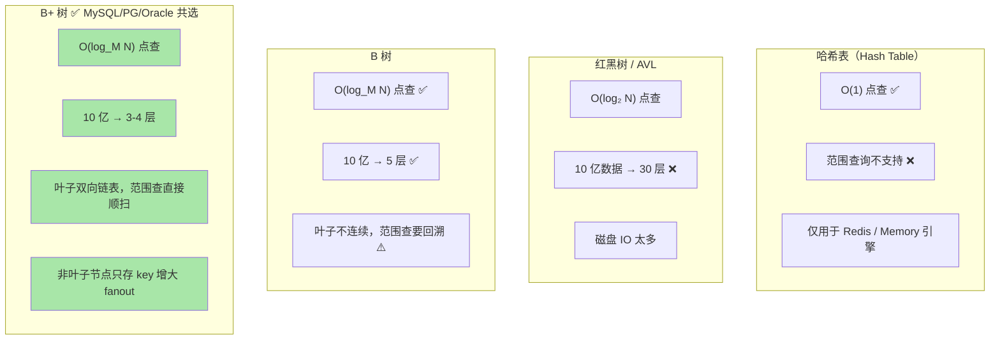

**B+ 树结构示意**（以 historicaldata 表为例）：

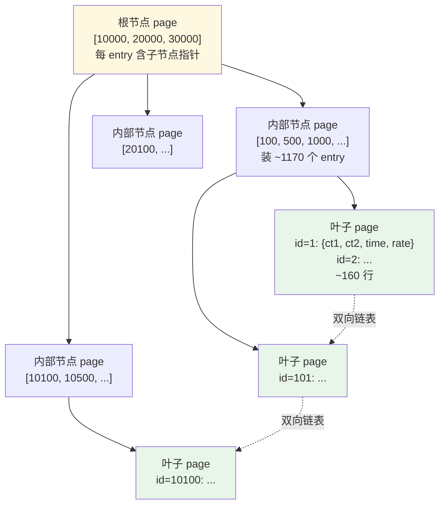

**B+ 树高度数学**（必背）：
- InnoDB page size = 16KB
- 非叶子节点每个 entry = key（8 字节）+ 子节点指针（6 字节）≈ 14 字节
- 一个非叶子 page 能装 16384 / 14 ≈ **1170 个 entry**
- 叶子 page 装一行（假设 100 字节）≈ 160 行
- **3 层 B+ 树 = 1170² × 160 ≈ 2.2 亿行**
- **4 层 B+ 树 = 1170³ × 160 ≈ 2500 亿行**
- → **生产中 B+ 树永远不会超过 4 层**，4 次磁盘 IO 封顶

### 三、聚簇 vs 非聚簇索引（图解 + 回表流程）

**InnoDB 的核心设计**——这是它和 MyISAM 最大的差别。

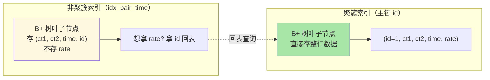

**回表的完整流程**（用 `SELECT * FROM historicaldata WHERE ct1='USD' AND ct2='JPY' ORDER BY time DESC LIMIT 1` 为例）：

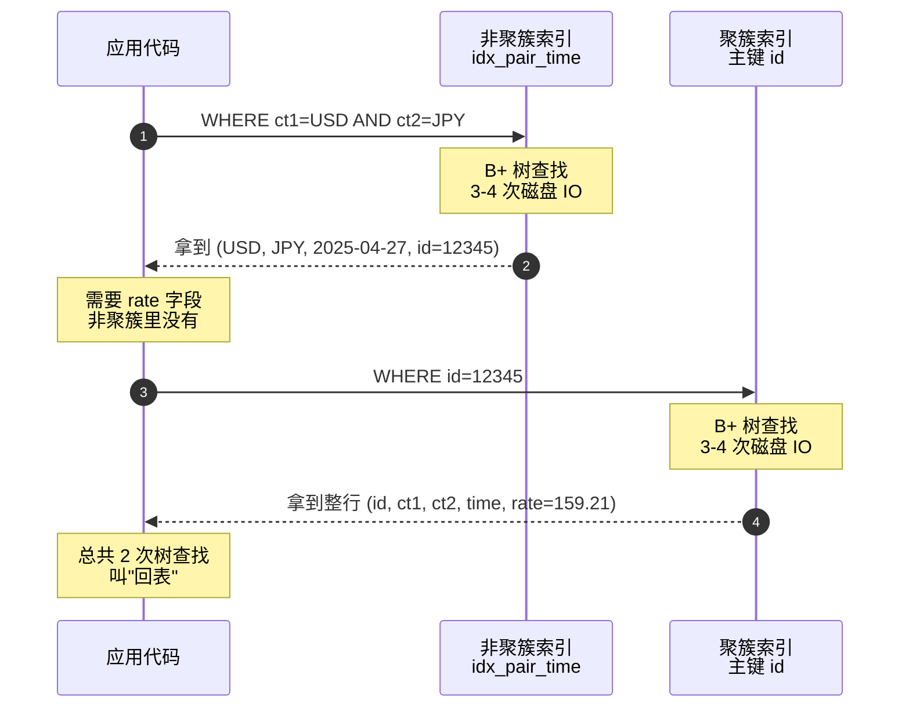

**关键优化：覆盖索引**

如果把 rate 也加进非聚簇索引：
```sql
INDEX idx_pair_time_rate (ct1, ct2, time, rate)
```

那么查询 `SELECT time, rate ...` 在非聚簇索引叶子节点就能拿到全部所需字段——**不用回表**，1 次树查找搞定。

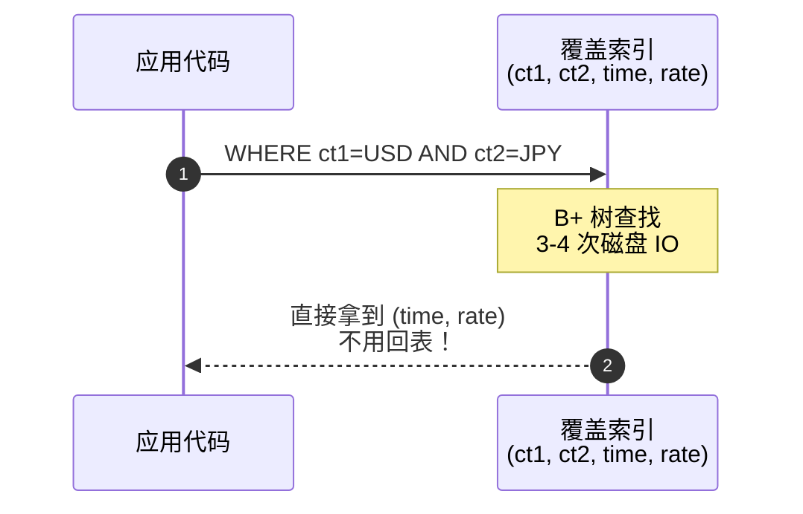

EXPLAIN 的 `Extra` 列会显示 `Using index` 表示用了覆盖索引——**生产 SQL 优化的金句**。

### 四、最左前缀原则（联合索引的关键）

联合索引 `(a, b, c)` 在 B+ 树里**按 (a, b, c) 字典序**排列。可视化：

```
叶子节点（按字典序排好的）:

[ct1=AUD, ct2=EUR, time=2024-01]
[ct1=AUD, ct2=EUR, time=2024-02]
[ct1=AUD, ct2=GBP, time=2024-01]
[ct1=AUD, ct2=GBP, time=2024-02]
...
[ct1=USD, ct2=AUD, time=2024-01]
...
[ct1=USD, ct2=JPY, time=2024-01]  ← WHERE ct1=USD AND ct2=JPY 从这里开始
[ct1=USD, ct2=JPY, time=2024-02]
[ct1=USD, ct2=JPY, time=2024-03]
...
```

**查询命中索引的判断**：

| WHERE 条件 | 用上索引？ | 原因 |
|---|---|---|
| `a=?` | ✅ | 最左前缀命中 |
| `a=? AND b=?` | ✅ | 前 2 列 |
| `a=? AND b=? AND c=?` | ✅ | 全命中 |
| `a=? AND c=?` | ⚠️ 部分 | a 用上，c 跳过 b 用不上 |
| `a>? AND b=?` | ⚠️ 部分 | a 范围查后 b 用不上（详见追问 3） |
| `b=? AND c=?` | ❌ | 缺最左 a，全表扫 |
| `a=? ORDER BY b` | ✅ | 字典序天然有序，ORDER BY 免排序 |

**项目里**：索引 `(currencytype1, currencytype2, time)` 三列顺序怎么定？
- ① **区分度大的放前面**——currencytype1 / 2 各 6 选 1（USD/EUR/GBP/JPY/HKD/AUD），time 是连续值（区分度最高）
- ② **常一起用的列要顺序对**——我们最高频查 `WHERE ct1=? AND ct2=? ORDER BY time DESC`
- ③ **range column 放最后**——time 是范围列（DESC、BETWEEN），放最后能享受 B+ 树叶子顺序扫优势

### 五、EXPLAIN 输出怎么读（慢查询定位核心工具）

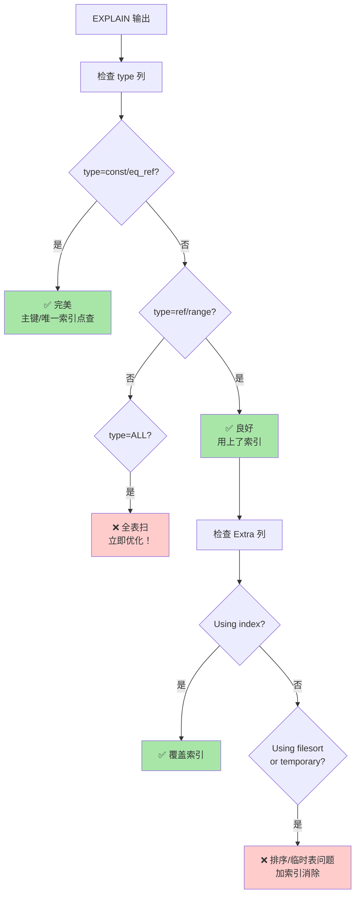

**关键列详解**：

| 列 | 含义 | 怎么看好坏 |
|---|---|---|
| **type** | 访问类型 | `const` > `eq_ref` > `ref` > `range` > `index` > **`ALL`（全表扫，坏）** |
| **key** | 实际用的索引 | NULL 说明没用索引 |
| **key_len** | 索引使用了几列字节 | 越大说明用上的列越多 |
| **rows** | 估计扫描行数 | 越小越好 |
| **Extra** | 额外信息 | `Using index`（覆盖✅）/ `Using filesort`（排序未用索引❌）/ `Using temporary`（临时表❌） |

我们项目的 query EXPLAIN 应该输出：
```
type=ref, key=idx_pair_time, key_len=12, rows=~30, Extra=Using where; Backward index scan
```

`Backward index scan` 是 MySQL 8 的优化——`ORDER BY time DESC` 不用专门 sort，直接反向走 B+ 树叶子链表。

### 六、生产化最佳实践

1. **主键用 BIGINT auto_increment**，不用 UUID
   - UUID 随机分布导致 B+ 树**频繁页分裂**，性能差 3-5×（详见追问 1）
   - 自增主键单调递增，新行总追加到 B+ 树最右叶子——**几乎没页分裂**

2. **索引不是越多越好**
   - 每个索引占空间（10 亿表 + 5 索引 = 索引比数据还大）
   - 每个写操作要更新所有索引（10 索引 = 10 次 B+ 树写）
   - **经验值**：单表索引 < 5 个

3. **online DDL 加索引**：MySQL 5.6+ 支持在线加索引不锁表
4. **避免索引失效**：`WHERE col != ?`、`OR`、`LIKE '%abc'`、对索引列用函数（`WHERE DATE(time)='2025-01-01'`）都让索引失效

### 七、深挖追问 Q&A

**Q1：为什么 InnoDB 推荐用自增主键？UUID 不行吗？**

A：技术上都行，**性能差别巨大**。InnoDB 是聚簇索引——数据按主键 B+ 树物理排序。

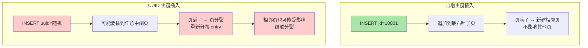

线上压测：UUID 主键的 INSERT QPS 大约比 auto_increment **慢 3-5 倍**。

如果业务一定要 UUID（如对外接口防猜测），**别让 UUID 当主键**，单独加一列建唯一索引：
```sql
id BIGINT AUTO_INCREMENT PRIMARY KEY,
uuid CHAR(36) UNIQUE
```
对外暴露 uuid，内部主键还是 id。

**Q2：覆盖索引能省多少？**

A：理论上省 50% IO（无回表 vs 有回表 = 1 次 vs 2 次树查找）。但因为索引页通常在 buffer pool 内存里，实际时间差只有 ~0.2ms。**10M+ 行的大表**，覆盖索引能让单查从 5ms → 1ms。

**Q3：`WHERE a=? AND b>? AND c=?` 索引 (a, b, c) 能完整用上吗？**

A：**只能用 a 和 b**。因为 b 是范围查询，B+ 树里 b 命中的子树**不再保证 c 有序**——c 走 ICP（Index Condition Pushdown）在存储引擎层过滤，比无索引强但比走索引弱。

**优化**：把范围列放最后建索引 `(a, c, b)`——a, c 都是等值，最后 b 做范围——3 列全用上。**调换索引列顺序是优化范围查询的常用招**。

**Q4：B+ 树的叶子节点是单向链表还是双向？**

A：**双向链表**。原因：① 支持 `ORDER BY ... DESC`（反向遍历）② 范围删除时要左右合并节点 ③ 树修复需要双向引用。代价：每叶子多存一个 prev 指针 8 字节。

**Q5：哈希索引完全没用吗？**

A：有限场景——
- **Memory 引擎默认哈希**：临时表场景
- **InnoDB 的自适应哈希索引（AHI）**：自动监控 B+ 树非叶子节点的访问频率，热到一定程度自动建哈希缓存——**应用层透明**
- **Redis 是哈希存储**

但生产关系型数据库主索引**绝不用哈希**——丢失范围查询能力。

**Q6：查询 EXPLAIN 看到 `type=ALL` 怎么排查？**

A：5 步——
1. 看 `key`：NULL 说明完全没用索引
2. 看 `rows`：≈ 表大小 → 全扫
3. 检查 WHERE 表达式：是否在索引列上用了函数 / 类型转换
4. 检查 OR：`WHERE a=? OR b=?` 通常导致全扫，改成 UNION
5. 看 Extra：`Using filesort` 加 ORDER BY 列到索引消除

---

## 1.2 事务隔离级别 + MVCC + 锁

### 面经原题
- "MySQL 4 个隔离级别 + 各能解决什么问题？"（蚂蚁后端高频）
- "幻读和不可重复读的区别？"
- "MVCC 怎么实现的？"
- "你们怎么避免超卖？"（电商 / 金融场景必问）

### 术语速通

| 术语 | 详细定义 |
|---|---|
| **事务（Transaction）** | 一组 SQL 操作的逻辑单元，要么全成功要么全失败 |
| **ACID** | 事务 4 特性的缩写：**A**tomicity（原子）/ **C**onsistency（一致）/ **I**solation（隔离）/ **D**urability（持久） |
| **隔离级别** | 多个并发事务之间互相能看到对方什么状态的级别。SQL 标准定义 4 级 |
| **RU** | Read Uncommitted 读未提交——最弱 |
| **RC** | Read Committed 读已提交——Oracle/PG 默认 |
| **RR** | Repeatable Read 可重复读——**MySQL InnoDB 默认** |
| **Serializable** | 串行化——最强但性能最差 |
| **脏读（Dirty Read）** | 读到了**没 commit** 的数据 |
| **不可重复读（Non-repeatable Read）** | 同事务里两次读**同一行**结果不同（因为别人 UPDATE 了） |
| **幻读（Phantom Read）** | 同事务里两次**范围查询**结果不同（因为别人 INSERT 了） |
| **MVCC** | Multi-Version Concurrency Control 多版本并发控制——InnoDB 实现 RC/RR 的底层 |
| **Undo Log** | InnoDB 的回滚日志，存旧版本数据，MVCC 靠它实现"读旧版本" |
| **Read View** | 一致性视图，事务读取时用来判断"哪个版本对我可见" |
| **快照读（Snapshot Read）** | 普通 SELECT，读 MVCC 的某个版本快照 |
| **当前读（Current Read）** | `SELECT ... FOR UPDATE` / `UPDATE` / `DELETE`，读最新数据 + 加锁 |
| **行锁（Row Lock）** | 锁单行索引记录，InnoDB 默认 |
| **Gap Lock（间隙锁）** | 锁索引记录之间的间隙，防 INSERT 进间隙，解决幻读 |
| **Next-Key Lock** | Row Lock + Gap Lock，InnoDB RR 级别默认 |
| **共享锁（S 锁 / Shared Lock）** | 读锁，多个 S 锁可共存 |
| **排他锁（X 锁 / Exclusive Lock）** | 写锁，完全互斥 |
| **死锁（Deadlock）** | 两事务互相等对方持有的锁 |

### 一、项目场景：我们的事务现状

CompassFXPulse 后端**所有 SQL 都是只读 SELECT**——5 个工具都不写 DB（写操作只在离线 script 里：`refresh.py` / `predict_rates.py`）。所以我们运行时**完全不触发事务并发问题**。

但**面试官一定会问支付场景**（特别是蚂蚁面试）——所以下面用"用户向银行账户转账"这种场景讲透。

### 二、4 个隔离级别 vs 3 类问题（核心矩阵）

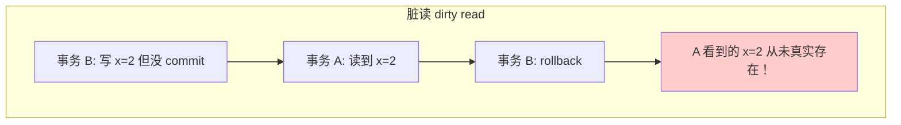

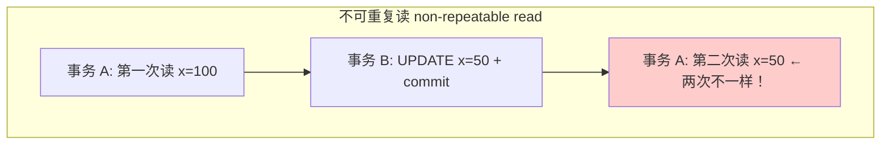

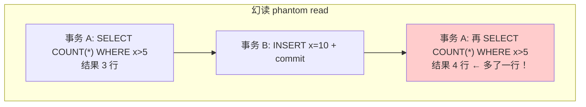

**4 级 vs 3 类问题对应矩阵**：

| 隔离级别 | 脏读 | 不可重复读 | 幻读 |
|---|---|---|---|
| RU（读未提交） | ❌ 可能 | ❌ 可能 | ❌ 可能 |
| **RC（读已提交，Oracle/PG 默认）** | ✅ 解决 | ❌ 可能 | ❌ 可能 |
| **RR（可重复读，MySQL InnoDB 默认）** | ✅ 解决 | ✅ 解决 | ⚠️ SQL 标准下可能，**InnoDB 用 next-key lock 基本解决** |
| Serializable（串行化） | ✅ 解决 | ✅ 解决 | ✅ 解决 |

**记忆口诀**：
- 脏读 = 看到没提交的（**事务 B 没 commit**）
- 不可重复读 = 同行两次读不一样（**事务 B 做了 UPDATE**）
- 幻读 = 范围查两次行数不一样（**事务 B 做了 INSERT/DELETE**）

### 三、MVCC（多版本并发控制）—— 图解

**MVCC 的核心思想**：每行数据存**多个版本**，事务读"自己事务开始时刻的版本"，不影响其他事务写——**读写不互斥**。这就是 InnoDB 高并发能力的根本。

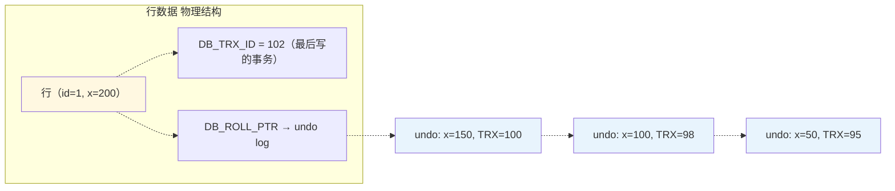

**事务读取时的 Read View 判断逻辑**：

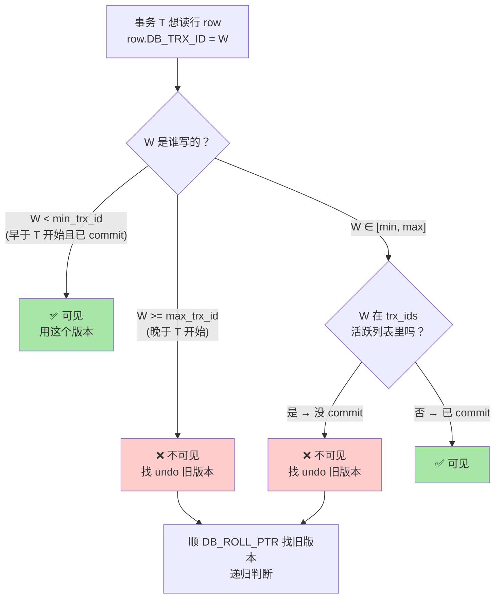

**RC vs RR 在 MVCC 上的差别**：

```mermaid
sequenceDiagram
    autonumber
    participant T1 as 事务 A (RC 级别)
    participant DB as MySQL
    participant T2 as 事务 B
    
    T1->>DB: BEGIN
    T1->>DB: SELECT x → 拿到 x=100<br/>(生成 read view #1)
    T2->>DB: UPDATE x=200; COMMIT
    T1->>DB: SELECT x → 拿到 x=200<br/>(重新生成 read view #2 ← 看到新值)
    Note over T1: RC: 每次 SELECT 都新建 read view<br/>→ 不可重复读
```

```mermaid
sequenceDiagram
    autonumber
    participant T1 as 事务 A (RR 级别)
    participant DB as MySQL
    participant T2 as 事务 B
    
    T1->>DB: BEGIN
    T1->>DB: SELECT x → 拿到 x=100<br/>(生成 read view 并冻结)
    T2->>DB: UPDATE x=200; COMMIT
    T1->>DB: SELECT x → 仍是 x=100<br/>(用冻结的 read view ← 看不到 B 的新值)
    Note over T1: RR: 事务里首次 SELECT 生成 read view 并冻结<br/>→ 可重复读
```

**关键认知**：**MVCC 只对 SELECT 生效**（快照读）。`SELECT FOR UPDATE` / `INSERT/UPDATE/DELETE` 叫**当前读**——读最新数据 + 加锁。

### 四、锁的家族（图解）

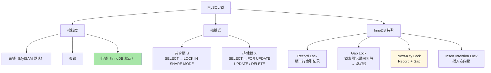

**S/X 锁兼容矩阵**：

| 已持有 \ 想加 | S | X |
|---|---|---|
| **S** | ✅ 兼容 | ❌ 互斥 |
| **X** | ❌ 互斥 | ❌ 互斥 |

### 五、避免超卖的工程方案

**问题**：库存 100，10 个用户同时下单——如果不做并发控制可能扣超。

**4 种方案对比**：

```mermaid
graph TB
    subgraph "方案 1: 悲观锁（FOR UPDATE）"
        P1["BEGIN<br/>SELECT FOR UPDATE → 拿 X 锁"]
        P2["if stock > 0:<br/>  UPDATE stock -= 1"]
        P3["COMMIT 释放锁"]
        P1 --> P2 --> P3
    end
    subgraph "方案 2: 乐观锁（CAS / version）"
        O1["SELECT stock, version"]
        O2["UPDATE stock=stock-1, version+=1<br/>WHERE id=? AND version=v_old"]
        O3["affected=0 → 冲突重试"]
        O1 --> O2 --> O3
    end
    subgraph "方案 3: 原子 SQL ✅ 推荐"
        A1["UPDATE stock=stock-1<br/>WHERE id=? AND stock>0"]
        A2["affected=0 → 库存不足"]
        A1 --> A2
    end
    subgraph "方案 4: Redis 预扣"
        R1["Redis DECR stock_redis"]
        R2["结果 > 0 才允许下单"]
        R3["异步落库"]
        R1 --> R2 --> R3
    end
    
    style A1 fill:#a8e6a8
```

**方案 3 原子 SQL** 是生产首选——单语句完成，**最简洁正确**。

### 六、深挖追问 Q&A

**Q1：MySQL 默认 RR，为什么互联网公司很多用 RC？**

A：阿里规约推 RC。3 个原因：
- **性能更好**——RR 用大量 gap lock 并发写场景容易死锁
- **业务自己做并发控制**——现代应用很少依赖严格不可重复读，用乐观锁 / 分布式锁兜底
- **binlog 兼容性**——RC 默认 row 模式 binlog 主备同步更稳定，RR 早期 statement 模式有 bug

**Q2：长事务的危害？**

A：3 大危害——
- **锁占用久**：SELECT FOR UPDATE 跑 10 分钟其他都得等
- **undo log 堆积**：长事务保留多版本数据让 read view 能读到旧版本，磁盘和查询都变慢
- **主备延迟**：长事务的 binlog 直到 commit 才同步给从库，延迟可能秒级

**生产规则**：事务不超过 1 秒；事务里禁止网络调用 / 文件操作 / RPC。

**Q3：怎么排查死锁？**

A：`SHOW ENGINE INNODB STATUS\G` 输出有 `LATEST DETECTED DEADLOCK` 段，列出冲突的两个事务、各自持有的锁、等待的锁、产生死锁的 SQL。InnoDB 探测到死锁自动选**回滚成本小的事务**牺牲，应用层捕获 `Error 1213` 并 retry。生产开 `innodb_print_all_deadlocks=ON`。

**Q4：InnoDB 的 RR 真的解决了幻读吗？**

A：**部分解决**——
- 对**快照读**（普通 SELECT）：MVCC 让两次读结果一样，表面解决
- 对**当前读**（SELECT FOR UPDATE）：next-key lock 锁住范围 + 间隙，INSERT 阻塞，也解决
- 但有 corner case：事务 A 先快照读 → 事务 B INSERT 一行 commit → 事务 A 再当前读 `SELECT ... FOR UPDATE` 能看到 B 插的新行——**仍是幻读**

完美解决幻读只能 Serializable，但代价大。

---

## 1.3 慢查询定位完整工作流

### 术语速通

| 术语 | 详细定义 |
|---|---|
| **slow query log** | MySQL 内置慢查询日志，超过 `long_query_time` 的 SQL 自动记下来 |
| **long_query_time** | 慢查询的阈值，默认 10s，生产通常设 1s |
| **mysqldumpslow** | MySQL 自带的慢查询日志分析工具 |
| **pt-query-digest** | Percona Toolkit 出品的高级慢查询分析工具 |
| **SHOW PROFILE** | MySQL 命令，看一条 SQL 各阶段的耗时（解析、排序、发送数据等） |

### 完整工作流（流程图）

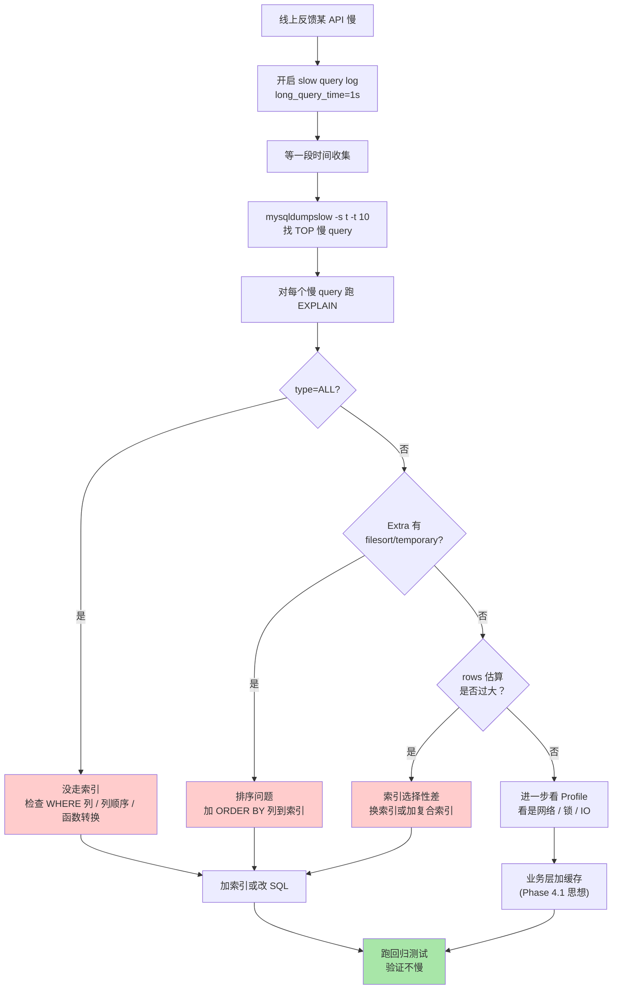

### 配置示例

```sql
SET GLOBAL slow_query_log=ON;
SET GLOBAL long_query_time=1;
SET GLOBAL log_queries_not_using_indexes=ON;
SET GLOBAL slow_query_log_file='/var/log/mysql-slow.log';
```

分析工具：
- `mysqldumpslow -s t -t 10 mysql-slow.log`：按总时间排序前 10
- `pt-query-digest mysql-slow.log`：Percona Toolkit 高级分析

### 深挖追问 Q&A

**Q：mysqldumpslow 的 `-s` 选项怎么选？**

A：3 种排序——
- `-s t`：按**总时间**排序（最影响 DB 的 query）—— **首选**
- `-s c`：按**出现次数**排序（最频繁）
- `-s al`：按**平均锁时间**（怀疑锁问题用）

总时间最长的 query 优化收益最大。

---

## 1.4 ORM vs raw SQL

### 术语速通

| 术语 | 详细定义 |
|---|---|
| **ORM** | Object-Relational Mapping 对象关系映射。用对象/类的方式操作 DB，不写 SQL |
| **SQLAlchemy** | Python 最流行的 ORM 库 |
| **N+1 问题** | ORM 关联对象懒加载导致的经典性能 bug——1 次查列表 + N 次查关联 |
| **Eager Load** | 主动加载关联对象，避免 N+1（如 `joinedload`） |
| **Lazy Load** | 按需加载关联对象，触发额外查询 |

### 我们为什么用 raw SQL

我们用 `mysql.connector`（raw SQL），不用 SQLAlchemy ORM。3 个原因：
1. **5 个工具的 SQL 都很简单**（单表 SELECT）——ORM 抽象收益小
2. **要看真实 SQL EXPLAIN**——ORM 生成的 SQL 不直观
3. **依赖更轻**——SQLAlchemy 启动加载慢

但**生产项目**（10+ 张表 + 关联查询）应该用 ORM——可读性、SQL 注入防护、迁移管理都更好。

### N+1 陷阱图解

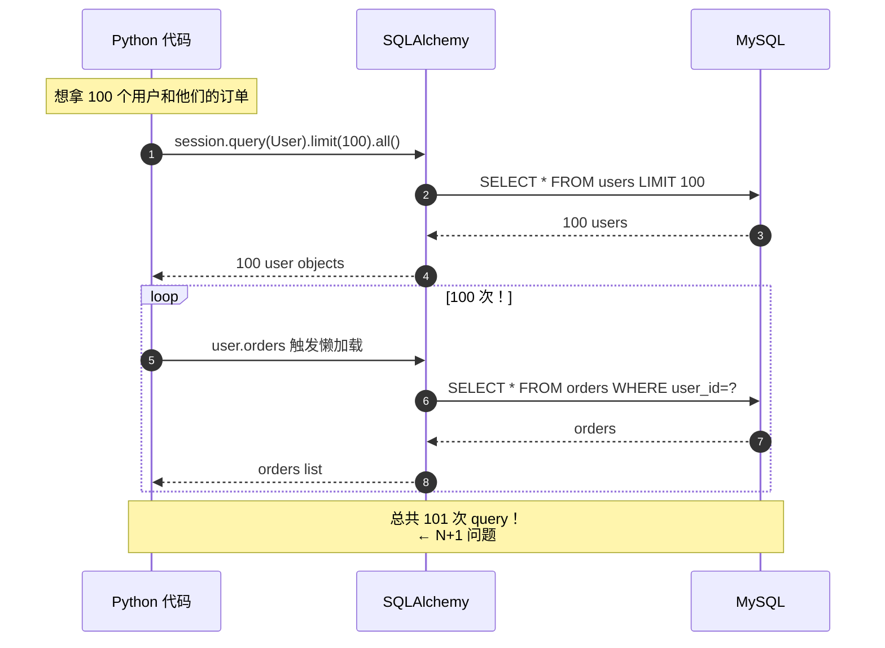

**修法：eager load**
```python
users = session.query(User).options(joinedload(User.orders)).limit(100).all()
# 1 次 JOIN 查询拿完所有数据
```

---

## 1.5 连接池设计与调参

### 术语速通

| 术语 | 详细定义 |
|---|---|
| **Connection Pool** | 连接池，预先建一组 DB 连接复用 |
| **pool_size** | 池子里常驻连接数 |
| **wait_timeout** | MySQL 服务端配置，连接空闲多久会被服务端 close（默认 8h） |
| **health check** | 拿连接前 ping 一下，确保连接还活着 |

### 我们的连接池

`backend/app/db.py`：
```python
pool = mysql.connector.pooling.MySQLConnectionPool(
    pool_name="compass_fx_pool",
    pool_size=20,        # Phase 4.1 从 5 → 20
    host=..., user=..., password=..., database=...,
    autocommit=False,
    charset="utf8mb4",
)
```

### 连接池工作机制

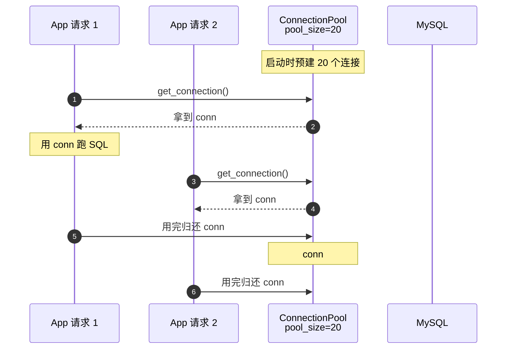

**为什么连接池有用**：
- 每次新 `mysql_connect()` 要做：TCP 三次握手（1 RTT）+ SSL 握手（2 RTT）+ MySQL handshake + 鉴权（2 RTT）≈ **5 RTT, ~50ms localhost / ~200ms 跨可用区**
- 连接池**预先建好**，请求来直接拿（< 1ms）

### pool_size 怎么定

**Java HikariCP 公式**（业内权威）：
```
connections = ((core_count × 2) + effective_spindle_count)
```
8 核 CPU + SSD → pool_size ≈ 17

**反直觉**：池子大 ≠ 性能好。
- DB 同时处理太多并发会因 lock contention / context switch 反而变慢
- 每个 conn 占 DB ~10MB 内存

**实战 rule of thumb**：
- 小服务：pool_size = (并发请求数 × 平均查询时间秒数) + buffer
- 蚂蚁/字节生产：通常 pool_size = 10-50 每实例

### 深挖追问 Q&A

**Q：连接闲置太久会不会被 MySQL 主动断？怎么办？**

A：会。MySQL 的 `wait_timeout`（默认 8 小时）超时空闲连接被服务端 close。客户端不知道，下次拿到 broken conn 报错。

**解法**：
- **拿连接前 ping 一下**（HikariCP `validationTimeout` / mysql-connector `pool_reset_session=True`）
- **客户端设 `auto_reconnect=True`** 失败自动重连

---

# 第 2 部分｜缓存设计（AI Agent 岗位必考）

## 2.1 Cache 三类问题（击穿 / 雪崩 / 穿透）

### 术语速通

| 术语 | 详细定义 |
|---|---|
| **缓存击穿（Cache Breakdown）** | **单个热点 key** 失效瞬间大量请求打 DB |
| **缓存雪崩（Cache Avalanche）** | **大量 key 同时失效**，所有流量打 DB |
| **缓存穿透（Cache Penetration）** | 查不存在的数据，缓存不缓存，每次都打 DB |
| **互斥锁（Mutex）/ Single-flight** | 让"同 key 的并发查询"只让 1 个真去 DB，其他等结果 |
| **Bloom Filter（布隆过滤器）** | 概率型数据结构，**有假阳性无假阴性** |
| **降级（Degradation）** | 服务挂了时返默认值或简化响应，**保命** |
| **熔断（Circuit Breaker）** | 失败率超阈值时直接拒绝请求，**给下游喘息** |

### 项目场景

`backend/app/cache.py` 实现了 TTLCache + Redis 双后端，Per-tool TTL（rate 1h / VaR 30min / RAG 10min）。但有 3 类问题没专门防（demo 流量低）：击穿 / 雪崩 / 穿透。

### 三类问题一图看懂

```mermaid
graph TB
    subgraph "缓存击穿 Breakdown"
        BR1["热 key 失效<br/>瞬间"] --> BR2["10w 并发<br/>都 cache miss"]
        BR2 --> BR3["都打 DB<br/>DB 短时 spike"]
    end
    
    subgraph "缓存雪崩 Avalanche"
        AV1["大量 key<br/>同时失效"] --> AV2["如 Redis 重启<br/>或 TTL 都对齐"]
        AV2 --> AV3["所有流量打 DB<br/>DB 直接挂"]
    end
    
    subgraph "缓存穿透 Penetration"
        PE1["查不存在的<br/>id=-1"] --> PE2["cache miss"]
        PE2 --> PE3["DB miss"]
        PE3 --> PE4["不缓存 NULL<br/>下次还 miss"]
        PE4 --> PE5["恶意脚本反复<br/>打 DB"]
    end
    
    style BR3 fill:#ffcccc
    style AV3 fill:#ffcccc
    style PE5 fill:#ffcccc
```

### 一、缓存击穿（Cache Breakdown）

**典型场景**：双 11 爆款商品 key TTL 到期，瞬间 10w QPS 涌进 DB；我们项目场景——`get_exchange_rate(USD, JPY)` TTL 1h 到点时如果有 100 并发都失效。

**4 种解法**：

**解法 A：互斥锁（Mutex / single-flight）**

```mermaid
sequenceDiagram
    autonumber
    participant U1 as User 1
    participant U2 as User 2
    participant U3 as User 3
    participant C as Cache
    participant L as Redis Lock
    participant D as DB
    
    Note over C: key TTL 失效
    
    par 3 用户同时来
        U1->>C: GET key
        C-->>U1: miss
        U2->>C: GET key
        C-->>U2: miss
        U3->>C: GET key
        C-->>U3: miss
    end
    
    U1->>L: SET lock NX EX=10
    L-->>U1: ✅ 拿到锁
    U2->>L: SET lock NX EX=10
    L-->>U2: ❌ 已被持有
    U3->>L: SET lock NX EX=10
    L-->>U3: ❌ 已被持有
    
    U1->>D: 真查 DB
    D-->>U1: value
    U1->>C: SET key value
    U1->>L: DEL lock
    
    Note over U2,U3: sleep 100ms 后重试
    U2->>C: GET key
    C-->>U2: ✅ hit
    U3->>C: GET key
    C-->>U3: ✅ hit
```

```python
def get_with_lock(key, fetch_db):
    val = cache.get(key)
    if val is not None:
        return val
    
    lock_key = f"lock:{key}"
    if redis.set(lock_key, 1, NX=True, EX=10):
        try:
            val = fetch_db(key)
            cache.set(key, val, ttl=3600)
            return val
        finally:
            redis.delete(lock_key)
    else:
        time.sleep(0.1)
        return cache.get(key) or fetch_db(key)
```

Go 的 `singleflight.Group` 是这个思想的语言级实现。

**解法 B：热点 key 永不过期 + 后台异步刷新**
- 缓存不设 TTL
- 后台 cron worker 每 N 分钟主动刷新

**解法 C：随机化 TTL + 提前刷新**
- TTL = 1h ± random(10min)
- 发现 TTL 剩余 < 10% 时异步触发刷新（不阻塞用户）

**解法 D：本地缓存兜底（多级缓存）**
- L1 in-memory（10 秒）+ L2 Redis（1h）

### 二、缓存雪崩（Cache Avalanche）

**典型场景**：Redis 重启 / 主从切换 → 所有缓存清空 → DB 瞬间淹；业务上线时一次性 set 1000 个 key TTL=1h → 1h 后这 1000 个 key 同时失效。

**5 种解法**：

```mermaid
graph TB
    Problem["缓存雪崩问题"] --> A["A. 随机化 TTL<br/>1h ± random(10min)"]
    Problem --> B["B. 多级缓存<br/>L1 + L2"]
    Problem --> C["C. 熔断降级<br/>DB QPS 超阈值返默认值"]
    Problem --> D["D. Redis 主从 + 哨兵"]
    Problem --> E["E. 缓存预热<br/>启动时主动加载"]
    
    style A fill:#a8e6a8
    style D fill:#a8e6a8
```

**项目里**：`cache.py` 有 Redis fallback——Redis 连不上自动退化为 in-memory TTLCache，解法 B + D 的轻量版。

### 三、缓存穿透（Cache Penetration）

**3 种解法**：

**解法 A：缓存空值（NULL caching）**
```python
def get_user(user_id):
    val = cache.get(f"user:{user_id}")
    if val is not None:
        return val if val != "__NULL__" else None
    
    user = db.query("SELECT * FROM users WHERE id=?", user_id)
    if user is None:
        cache.set(f"user:{user_id}", "__NULL__", ttl=300)  # 短 TTL
        return None
    cache.set(f"user:{user_id}", user, ttl=3600)
    return user
```

**解法 B：Bloom Filter** — 图解

Bloom Filter 是**概率型数据结构**——判断"元素是否存在"，**有假阳性无假阴性**：
- 说"不存在"——一定不存在 ✅
- 说"存在"——可能存在（要去查 DB 确认）

```mermaid
graph TB
    subgraph "Bloom Filter 内部 = bit 数组"
        BA["位置: 0 1 2 3 4 5 6 7 8 9 ...<br/>值:     0 1 0 1 1 0 0 1 0 1 ..."]
    end
    
    subgraph "添加元素 'alice'"
        AD1["hash1('alice') = 1"] --> SET1["位置 1 置 1"]
        AD2["hash2('alice') = 4"] --> SET2["位置 4 置 1"]
        AD3["hash3('alice') = 7"] --> SET3["位置 7 置 1"]
    end
    
    subgraph "查询 'bob'"
        Q1["hash1('bob') = 1<br/>位置 1 = 1 ✅"] --> Q2["hash2('bob') = 3<br/>位置 3 = 1 ✅"]
        Q2 --> Q3["hash3('bob') = 8<br/>位置 8 = 0 ❌"]
        Q3 --> Q4["**一定不存在**<br/>(不去查 DB)"]
    end
    
    subgraph "查询 'alice'"
        QA1["hash1 → 1 ✅<br/>hash2 → 4 ✅<br/>hash3 → 7 ✅"] --> QA2["**可能存在**<br/>(去 DB 确认)"]
    end
    
    style Q4 fill:#a8e6a8
    style QA2 fill:#fff8e1
```

```python
from pybloom_live import BloomFilter

bf = BloomFilter(capacity=10_000_000, error_rate=0.001)
for uid in db.query("SELECT id FROM users"):
    bf.add(uid)

def get_user(user_id):
    if user_id not in bf:
        return None  # 一定不存在
    ...
```

**好处**：125MB 内存挡住所有"不存在 id"的请求。
**代价**：① 假阳性少量请求穿透 ② 删除困难

**解法 C：参数校验**：拒绝 id < 0 等非法值

### 解决方案选择矩阵

| 场景 | 推荐解法 |
|---|---|
| 单个热 key 偶尔失效 | 互斥锁（解法 A）|
| 大量 key 同时失效（雪崩） | TTL 随机化 + 多级缓存 + Redis 哨兵 |
| 恶意脚本攻击不存在的 id | Bloom Filter + 参数校验 |
| 业务自然的 NULL | 缓存空值（短 TTL） |

### 深挖追问 Q&A

**Q1：缓存击穿 vs 雪崩区别？**

A：**击穿 = 单点失效**（一个热 key 失效 + 高并发）；**雪崩 = 群体失效**（很多 key 同时失效）。解法不同——击穿用 single-flight，雪崩用分散失效时间 + 限流降级。

**Q2：Bloom Filter 怎么调参数？**

A：3 个变量——n=元素数, m=bit 数组大小, k=hash 函数个数, p=假阳性率。

公式：`p = (1 - e^(-kn/m))^k`，最优 `k = (m/n) × ln(2)`。

**典型配置**：1000 万元素 + 0.1% 假阳性 = ~125 MB + 10 个 hash 函数。

**Q3：Bloom Filter 怎么删除元素？**

A：标准 Bloom Filter **不支持删除**——把 bit 设回 0 可能影响其他元素。

**2 个方案**：
- **Counting Bloom Filter**：每位置是计数器（add +1, delete -1）。代价：内存 ×4-8
- **重建**：周期性根据 DB 全量重建

---

## 2.2 Cache 4 种读写模式

### 术语速通

| 术语 | 详细定义 |
|---|---|
| **Cache-Aside（旁路）** | 应用主动管理 cache（读 miss 时查 DB 写 cache，写时改 DB 删 cache） |
| **Read-Through** | cache 层负责读 DB 填充自己，应用只跟 cache 打交道 |
| **Write-Through** | cache 层负责把写同步到 DB |
| **Write-Back（Write-Behind）** | 写只到 cache，cache 层异步落 DB |

### 4 种模式数据流对比

```mermaid
graph TB
    subgraph "Cache-Aside (业内 95% 用这个)"
        CA1["App"] --> CA2["Cache"]
        CA1 -.miss 时.-> CA3["DB"]
        CA1 -.写 DB 后删 cache.-> CA3
    end
    
    subgraph "Read-Through"
        RT1["App"] --> RT2["Cache 层<br/>(自己管 DB)"]
        RT2 -.内部.-> RT3["DB"]
    end
    
    subgraph "Write-Through"
        WT1["App"] -.write.-> WT2["Cache"]
        WT2 -.同步写.-> WT3["DB"]
    end
    
    subgraph "Write-Back / Write-Behind"
        WB1["App"] -.write.-> WB2["Cache"]
        WB2 -.异步批量.-> WB3["DB"]
    end
    
    style CA2 fill:#a8e6a8
    style CA3 fill:#a8e6a8
```

### Cache-Aside 详解（关键有坑）

**读流程**：
```
1. 应用先查 cache
2. miss → 查 DB → 写 cache → 返回
3. hit → 直接返回
```

**写流程**（**关键，有坑**）：

```mermaid
sequenceDiagram
    autonumber
    participant W as 写线程
    participant R as 读线程
    participant C as Cache
    participant DB as DB
    
    Note over C,DB: 错误顺序：先 del cache 后 update DB
    
    W->>C: DEL key
    R->>C: GET key → miss
    R->>DB: SELECT → 拿到旧值 x=1
    R->>C: SET key=1（旧值！）
    W->>DB: UPDATE x=2
    
    Note over C,DB: 结果: cache=1, DB=2<br/>永久不一致！❌
```

```mermaid
sequenceDiagram
    autonumber
    participant W as 写线程
    participant R as 读线程
    participant C as Cache
    participant DB as DB
    
    Note over C,DB: 正确顺序：先 update DB 后 del cache
    
    W->>DB: UPDATE x=2
    R->>C: GET key → miss
    R->>DB: SELECT → 拿到新值 x=2
    R->>C: SET key=2
    W->>C: DEL key（即使删，下次重建也是从 DB 拿 2）
    
    Note over C,DB: 结果: cache 暂时丢但很快重建，DB=2<br/>最终一致 ✅
```

**为什么 del 而不是 update**：并发写时两个写线程对 cache 的 update 顺序可能和 DB 顺序相反 → 不一致。**del 后让 cache miss 重建是简单可靠的**。

### 深挖追问 Q&A

**Q：先 del cache 后 update DB 有补救吗？**

A：有 **"延时双删"** —— `del cache → update DB → sleep 0.5s → del cache 再删一次`。第二次 del 清掉中间被并发读线程写回的旧值。但 sleep 时间难定，业内更推荐**先更新 DB 后删 cache** —— 简单、不需要 sleep、并发安全。

---

## 2.3 Redis 5 基本数据结构与底层

### 术语速通

| 术语 | 详细定义 |
|---|---|
| **SDS** | Simple Dynamic String，Redis String 的底层结构 |
| **ziplist** | 压缩列表，小数据用，节省内存 |
| **quicklist** | ziplist 链表（List 在 v3.2+ 用这个）|
| **hashtable** | Redis 内部哈希表实现 |
| **intset** | 整数集合，纯整数 Set 用 |
| **skiplist** | 跳跃表，有序链表 + 多层索引 |
| **HyperLogLog** | 概率型去重计数结构（12KB 估算 2⁶⁴ 个元素） |
| **GEO** | Redis 地理位置索引（底层 ZSet） |

### 5 基本数据结构 + 底层（图解）

```mermaid
graph TB
    Redis["Redis 5 基本数据结构"]
    
    Redis --> String["String<br/>底层: SDS / int<br/>用途: KV / 计数器 / SETNX"]
    Redis --> List["List<br/>底层: quicklist<br/>用途: 队列 / 最近访问"]
    Redis --> Hash["Hash<br/>底层: ziplist 小 / hashtable 大<br/>用途: 用户对象"]
    Redis --> Set["Set<br/>底层: intset 纯整数 / hashtable<br/>用途: 标签 / 共同好友"]
    Redis --> ZSet["ZSet 有序集合<br/>底层: ziplist 小 /<br/>skiplist + hashtable 大<br/>用途: 排行榜 / 延迟队列"]
    
    style ZSet fill:#fff8e1
```

### SDS（简单动态字符串）

Redis String 不是 C 的 `char*`——是 **SDS**：

```c
struct sdshdr {
    int len;      // 已用长度
    int free;     // 剩余空间
    char buf[];   // 数据
};
```

**SDS 比 C 字符串好在哪**：
1. **O(1) 获取长度**（C 字符串要 strlen 遍历）
2. **二进制安全**（C 字符串遇 \0 截断，SDS 不会）
3. **预分配空间**（避免每次扩容 realloc）
4. **惰性释放**（缩容时不立刻 free）

### 为什么 ZSet 用 skiplist 不用红黑树

```mermaid
graph LR
    subgraph "Skiplist 跳跃表"
        L4["Level 4: ----------→---------→"]
        L3["Level 3: --→--------→---------→"]
        L2["Level 2: --→---→---→---→------→"]
        L1["Level 1: 1→3→5→7→9→11→13→15→17→19"]
    end
    
    style L1 fill:#a8e6a8
```

**Skiplist 是有序链表 + 多层索引**——平均查找 O(log n)。

**为什么 Redis 选 skiplist**：
1. **范围查询天然友好**——ZRANGEBYSCORE 是 ZSet 最常用操作
2. **实现简单**——红黑树旋转代码复杂
3. **缓存友好**——节点物理连续

Redis 作者 antirez 在 Antirez weblog 写过原因："skiplist is simpler to implement, debug, and modify"。

### 深挖追问 Q&A

**Q：HyperLogLog 是什么？为什么内存这么小？**

A：HyperLogLog（HLL）是**概率型去重计数**结构——**12KB 内存估算 2⁶⁴ 个不同元素**，误差 0.81%。

**原理**（简化）：把元素 hash 后看二进制前缀有几个 0，记录最大那个数。直觉：随机 hash 前缀全 0 的概率指数下降，所以"前缀最长 0 数"反映总元素量级。

用于 UV 统计这种"不要求精确"的场景。命令：`PFADD / PFCOUNT / PFMERGE`。**比 Set 省 N 万倍内存**。

---

## 2.4 Redis 持久化（RDB / AOF / 混合）

### 术语速通

| 术语 | 详细定义 |
|---|---|
| **RDB** | Redis Database Backup，全量快照持久化 |
| **AOF** | Append Only File，命令日志持久化 |
| **fork()** | Unix 系统调用，复制当前进程为子进程 |
| **COW** | Copy-On-Write 写时复制，fork() 不真复制内存，只在写时才复制对应页 |
| **fsync** | 文件系统调用，强制把缓冲区数据刷盘 |

### RDB vs AOF 对比图

```mermaid
graph TB
    subgraph "RDB 定时快照"
        R1["每 N 秒/N 次写触发"]
        R2["fork() 子进程"]
        R3["子进程扫描内存<br/>dump 到 .rdb 文件"]
        R4["主进程继续服务<br/>COW 写时复制"]
        R1 --> R2 --> R3
        R2 --> R4
    end
    
    subgraph "AOF 命令日志"
        A1["每个写命令<br/>追加到 .aof 文件"]
        A2["3 种 fsync 策略"]
        A2a["always: 每写都 fsync<br/>(最安全 最慢)"]
        A2b["everysec: 每秒 fsync<br/>(默认 折中)"]
        A2c["no: OS 决定<br/>(最快 最不安全)"]
        A1 --> A2
        A2 --> A2a
        A2 --> A2b
        A2 --> A2c
    end
    
    style A2b fill:#a8e6a8
```

**对比表**：

| | RDB | AOF |
|---|---|---|
| 文件 | 小（二进制紧凑）| 大（命令文本） |
| 恢复 | 快（直接 load）| 慢（要重放命令） |
| 数据安全 | 丢最近 N 分钟 | 最多丢 1s（everysec） |
| fork 卡顿 | 大内存下秒级阻塞 | 仅 AOF rewrite 时 fork |

### 混合持久化（Redis 4.0+ 默认）

`aof-use-rdb-preamble yes`——AOF rewrite 时**先写 RDB 格式**到 AOF 头部，然后追加新命令。

```mermaid
graph LR
    Start["AOF rewrite 触发"] --> RDB["头部: RDB 二进制<br/>(当前内存快照)"]
    RDB --> Cmds["尾部: 增量命令<br/>(rewrite 期间新写入的)"]
    Cmds --> Final["合并成新 AOF 文件"]
    
    Final --> Recover["恢复时:<br/>1. load RDB 头 (快)<br/>2. 重放尾部命令 (少量)"]
    
    style Final fill:#a8e6a8
```

**生产推荐配置**：
```
save 900 1
save 300 10
appendonly yes
appendfsync everysec
aof-use-rdb-preamble yes
```

### 深挖追问 Q&A

**Q：fork() 在大内存 Redis 上为什么慢？**

A：fork() 不是真复制内存（COW），但**需要复制页表**。

```mermaid
graph LR
    P1["主进程<br/>64GB 内存"] --> PT["页表 ~128MB<br/>(64GB / 4KB × 8B entry)"]
    PT -.fork().-> Child["子进程<br/>共享物理页"]
    
    Note["fork() 必须把 128MB 页表整个复制<br/>→ 几百 ms 到秒级<br/>→ 主进程阻塞"]
    
    style Note fill:#ffcccc
```

64GB 内存 Redis 页表 ~128MB。fork() 时内核必须把这 128MB 整个复制——**几百 ms 到秒级**——主进程阻塞。**生产 Redis 实例建议 < 32GB**，避免 fork 卡顿。

---

## 2.5 Redis 高可用（主从 / 哨兵 / 集群）

### 术语速通

| 术语 | 详细定义 |
|---|---|
| **Master/Slave 主从** | 写主读从的复制结构 |
| **PSYNC** | Redis 主从同步命令，支持 full sync + partial sync |
| **repl_backlog_buffer** | master 维护的 N MB 环形 buffer，存最近同步的命令，用于增量同步 |
| **Sentinel 哨兵** | 监控 master 心跳，挂了选新 master |
| **SDOWN / ODOWN** | 主观下线 / 客观下线 |
| **Cluster 集群** | Redis 6+ 的水平分片方案，16384 个 slot |
| **slot 槽** | Redis Cluster 把数据分成的逻辑单元（16384 个） |
| **Hash Tag** | `{user:1000}.profile` 里 `{}` 内的部分用于强制同 slot |

### 主从复制架构图

```mermaid
graph TB
    Master["Master<br/>写主"]
    Slave1["Slave 1<br/>读从"]
    Slave2["Slave 2<br/>读从"]
    Slave3["Slave 3<br/>读从"]
    
    Master -.异步同步命令.-> Slave1
    Master -.异步同步命令.-> Slave2
    Master -.异步同步命令.-> Slave3
    
    Client1["Client 写"] -.W.-> Master
    Client2["Client 读"] -.R.-> Slave1
    Client3["Client 读"] -.R.-> Slave2
    
    style Master fill:#fff8e1
    style Slave1 fill:#e8f4fd
    style Slave2 fill:#e8f4fd
    style Slave3 fill:#e8f4fd
```

**首次同步（full sync）流程**：

```mermaid
sequenceDiagram
    autonumber
    participant S as Slave
    participant M as Master
    
    S->>M: PSYNC ? -1 (首次连接，无 offset)
    Note over M: 触发 BGSAVE
    M-->>S: +FULLRESYNC <runid> <offset>
    Note over M: fork() 子进程<br/>dump RDB
    M->>S: 发送 .rdb 文件 (全量)
    Note over M: 把 RDB 期间的<br/>新命令存 repl_backlog_buffer
    M->>S: 发送 backlog 期间累积的命令
    Note over S: load RDB + apply 命令
    
    loop 后续运行时
        M->>S: 实时推送新写命令
    end
```

**断线重连优化（partial sync）**：Slave 重连时如果 master 的 backlog 还有它断线时的 offset → **只发增量** 不重做全量。

### 哨兵 failover 流程

```mermaid
sequenceDiagram
    autonumber
    participant S1 as Sentinel 1
    participant S2 as Sentinel 2
    participant S3 as Sentinel 3
    participant M as Master (挂了)
    participant Sl1 as Slave 1
    participant Sl2 as Slave 2
    
    S1->>M: PING 每秒
    M--xS1: 30s 无响应
    Note over S1: 主观下线 SDOWN
    
    S1->>S2: 你也认为 master 挂了吗？
    S1->>S3: 你也认为 master 挂了吗？
    S2-->>S1: 是
    S3-->>S1: 是
    Note over S1: 多数同意 → 客观下线 ODOWN
    
    S1->>S2: 投我当 leader
    S2-->>S1: ✅
    S1->>S3: 投我当 leader
    S3-->>S1: ✅
    Note over S1: 当选 leader
    
    Note over S1,Sl2: 从 slaves 选新 master<br/>(优先级 + offset 最大)
    S1->>Sl1: 你升主
    S1->>Sl2: 改 replicate 目标到 Sl1
    
    S1->>S2: 广播新 master 地址
    S1->>S3: 广播新 master 地址
```

**为什么需要 3 个奇数 Sentinel**：投票需要多数派（majority）。3 个能容忍 1 个挂，5 个能容忍 2 个。

### Redis Cluster 架构

```mermaid
graph TB
    subgraph "Cluster 16384 个 slot"
        N1["Node 1 Master<br/>slot 0-5460"]
        N2["Node 2 Master<br/>slot 5461-10922"]
        N3["Node 3 Master<br/>slot 10923-16383"]
        
        N1S["Node 1 Slave"]
        N2S["Node 2 Slave"]
        N3S["Node 3 Slave"]
        
        N1 -.主从.-> N1S
        N2 -.主从.-> N2S
        N3 -.主从.-> N3S
    end
    
    Client["Client"] -.SET key=user:1000.-> CRC16["CRC16(key) % 16384<br/>= 5042"]
    CRC16 --> Route["→ slot 5042 在 Node 1"]
    Route --> N1
    
    style N1 fill:#fff8e1
    style N2 fill:#fff8e1
    style N3 fill:#fff8e1
```

**Hash Tag**：`{user:1000}.profile` 和 `{user:1000}.orders` 因为 `{}` 内一样 → 同 slot——**保证多 key 操作（MGET、事务）可用**。

### 深挖追问 Q&A

**Q：哨兵能解决脑裂吗？**

A：**有限**。网络分区可能出现两个 master 同时接收写。**Redis 配置 `min-replicas-to-write 1`**——master 要求至少 1 个 slave 接收复制才接受写——能减轻脑裂数据丢失。

**Q：Redis Cluster 支持事务吗？跨 slot 的事务呢？**

A：单 slot 内事务（MULTI/EXEC）支持。**跨 slot 不支持**——不同节点上的 key 没法原子操作。**解法**：用 hash tag 强制相关 key 同 slot。

---

## 2.6 多级缓存 + Bloom Filter 应用

### 多级缓存架构

```mermaid
graph LR
    Client["浏览器"] --> CDN["CDN<br/>静态资源"]
    CDN --> Nginx["Nginx<br/>静态缓存"]
    Nginx --> L1["L1 进程内<br/>Caffeine/TTLCache<br/>纳秒级 不共享"]
    L1 --> L2["L2 Redis<br/>毫秒级 全局共享"]
    L2 --> DB["DB<br/>10ms+ 权威"]
    
    style L1 fill:#fff8e1
    style L2 fill:#e8f4fd
    style DB fill:#ffcccc
```

每级特点：
- **L1（进程内）**：纳秒级，但不共享
- **L2（Redis）**：毫秒级，全局共享
- **DB**：10ms+，权威数据

**我们项目当前**：L1（in-memory TTLCache）或 L2（Redis）二选一。生产升级 Phase 4.6 路线：L1 + L2 双层。

### 热点 key 分散方案

```mermaid
graph TB
    Hot["热 key: product:1001<br/>QPS 10w 单节点扛不住"]
    
    Hot --> Split["分散为 10 副本"]
    Split --> K1["product:1001:0"]
    Split --> K2["product:1001:1"]
    Split --> K3["..."]
    Split --> K10["product:1001:9"]
    
    Client1["Client"] -.随机选 0-9.-> K1
    Client2["Client"] -.随机选 0-9.-> K5
    Client3["Client"] -.随机选 0-9.-> K9
    
    Note["写入时所有副本一起写<br/>读取时随机一个"]
    
    style Hot fill:#ffcccc
    style Split fill:#a8e6a8
```

**热点 key 发现方法**：
- Redis `MONITOR`（开销大，仅排查用）
- `redis-cli --hotkeys`（4.0+）
- 业务监控：每 key 访问次数累计（Prometheus）

---

# 第 3 部分｜并发与异步（AI Agent 岗位必考）

## 3.1 线程池 7 参数 + 调参方法论

### 术语速通

| 术语 | 详细定义 |
|---|---|
| **Thread Pool 线程池** | 预先创建一组线程复用，避免每请求新建 |
| **corePoolSize** | 核心线程数，常驻 |
| **maximumPoolSize** | 最大线程数（含临时） |
| **workQueue** | 任务队列 |
| **keepAliveTime** | 临时线程空闲多久销毁 |
| **RejectedExecutionHandler** | 拒绝策略，池子和队列都满时怎么处理 |
| **Little's Law** | 排队论公式 `N = QPS × avg_latency` |

### ThreadPoolExecutor 7 参数

```java
new ThreadPoolExecutor(
    int corePoolSize,                       // 核心线程数（常驻）
    int maximumPoolSize,                    // 最大线程数（含临时）
    long keepAliveTime,                     // 临时线程空闲多久销毁
    TimeUnit unit,
    BlockingQueue<Runnable> workQueue,      // 任务队列
    ThreadFactory threadFactory,            // 线程工厂（命名/优先级）
    RejectedExecutionHandler handler        // 拒绝策略
);
```

### 任务到来时的处理流程（图解）

```mermaid
flowchart TB
    New["新任务 execute(task)"] --> C1{"当前线程数<br/>< corePoolSize?"}
    C1 -->|是| C1Y["新建核心线程跑<br/>(即使队列空闲也建)"]
    C1 -->|否| C2{"入队 workQueue 成功?"}
    C2 -->|是| C2Y["等空闲线程拉"]
    C2 -->|否(队列满)| C3{"线程数<br/>< maximumPoolSize?"}
    C3 -->|是| C3Y["新建临时线程跑"]
    C3 -->|否(临时也满)| Reject["触发<br/>RejectedExecutionHandler"]
    
    style C1Y fill:#a8e6a8
    style C2Y fill:#a8e6a8
    style C3Y fill:#fff8e1
    style Reject fill:#ffcccc
```

**反直觉点**：第 2 步是**先入队再扩线程**。这是 Java 的设计：**优先用最少线程做事**。

### 4 种拒绝策略

| 策略 | 行为 | 使用场景 |
|---|---|---|
| `AbortPolicy`（默认）| 抛 `RejectedExecutionException` | 调用方需要知道失败 |
| `CallerRunsPolicy` | **调用线程自己跑** | 反压效果好，自然降速 |
| `DiscardPolicy` | 丢弃新任务，不抛异常 | **危险**，丢失感知不到 |
| `DiscardOldestPolicy` | 丢弃队列最老的，新任务进队 | 弱重要性消息 |

### 调参方法论

**CPU 密集型任务**（图像处理、加密、纯算法）：
- `corePoolSize ≈ CPU 核数`
- 公式：`N = N_cpu + 1`（多 1 个做 IO 偶发等待）

**I/O 密集型任务**（API、DB、文件）：
- `corePoolSize = CPU 核数 × 2` 或更多
- **Little's Law**：`N = QPS × avg_latency_seconds`
- 例：100 QPS × 100ms 平均延迟 = 10 线程

**LLM 应用（重 I/O）**：
- 一般 N = 20-50 起步
- 我们项目 FastAPI `asyncio.to_thread()` 默认 thread pool = 40

### 为什么阿里规约不让用 `Executors`

```mermaid
graph TB
    subgraph "Executors.newFixedThreadPool(N)"
        E1["内部用 LinkedBlockingQueue<br/>(无界)"]
        E2["任务积压 → 队列疯狂增长"]
        E3["最终 OOM"]
        E1 --> E2 --> E3
    end
    
    subgraph "Executors.newCachedThreadPool()"
        F1["maxPoolSize = Integer.MAX_VALUE"]
        F2["任务多 → 无限新建线程"]
        F3["最终 OOM"]
        F1 --> F2 --> F3
    end
    
    style E3 fill:#ffcccc
    style F3 fill:#ffcccc
```

**正确写法**：
```java
ThreadPoolExecutor executor = new ThreadPoolExecutor(
    10, 50, 60, TimeUnit.SECONDS,
    new ArrayBlockingQueue<>(1000),  // 有界队列
    new ThreadFactoryBuilder().setNameFormat("biz-%d").build(),
    new ThreadPoolExecutor.CallerRunsPolicy()  // 反压
);
```

### 深挖追问 Q&A

**Q：corePoolSize=10 且队列已有 100 个任务，第 11 个任务怎么处理？**

A：**还是入队**。10 个核心线程满了不会再新建。只有队列也满了才触发新建临时线程到 max。

**Q：怎么知道线程池配得对？**

A：3 个监控指标——
- `activeCount`：当前活跃线程数
- `getQueue().size()`：队列长度
- 任务平均执行时间

如果 activeCount 长期 = corePoolSize 且队列积压 → core 太少；
如果 activeCount 总是 = max → max 太少；
如果队列一直 0 但线程一直跑 → 池子大小合适。

---

## 3.2 Python GIL + asyncio 事件循环深解

### 术语速通

| 术语 | 详细定义 |
|---|---|
| **GIL** | Global Interpreter Lock 全局解释器锁——CPython 的全局互斥锁 |
| **CPython** | Python 的官方 C 实现，绝大多数生产 Python 都是 CPython |
| **asyncio** | Python 3.4+ 标准库的异步框架 |
| **Event Loop** | 事件循环，asyncio 核心 |
| **Coroutine** | 协程，用户态轻量级"线程" |
| **await** | Python 关键字，协程让出控制权的点 |
| **协作式调度** | 协程主动让出，不像线程被 OS 抢占 |
| **抢占式调度** | OS 决定何时切换线程，线程不知情 |
| **I/O Bound** | I/O 密集型任务，大部分时间等数据 |
| **CPU Bound** | CPU 密集型任务，CPU 满载 |

### GIL（Global Interpreter Lock）

**GIL 是什么**：CPython 解释器的全局锁——**同一进程内同时只有 1 个线程能跑 Python 字节码**。

```mermaid
graph TB
    subgraph "CPython 进程"
        GIL["GIL（全局唯一锁）"]
        T1["线程 1"]
        T2["线程 2"]
        T3["线程 3"]
        T4["线程 4"]
        
        GIL -.持有.-> T1
        T2 -.等待.-> GIL
        T3 -.等待.-> GIL
        T4 -.等待.-> GIL
    end
    
    Note["同一时刻只有 T1 能跑 Python 字节码<br/>T2/T3/T4 都在等 GIL<br/>→ 多线程对 CPU 密集任务没用"]
    
    style GIL fill:#ffcccc
```

**为什么有 GIL**：
- CPython 内存管理（引用计数）不是 thread-safe
- 没 GIL 要给每个对象加锁，开销大
- 历史包袱：1990s 设计时还没多核

**结果**：
- **CPU 密集型 Python 多线程没真并行**
- **I/O 密集型 OK**（等 I/O 时释放 GIL）

**绕开 GIL 3 方法**：
1. **多进程**（`multiprocessing` / `ProcessPoolExecutor`）——每进程一个 GIL
2. **C 扩展**（NumPy / PyTorch 在 native code 里释放 GIL）
3. **asyncio**——单线程不存在 GIL 争用

### asyncio 事件循环架构

```mermaid
graph TB
    EL["Event Loop 事件循环<br/>单线程 while True"]
    
    EL --> Q1["Ready Queue 就绪队列<br/>(I/O ready 的协程)"]
    EL --> Q2["Timer Queue 定时器队列<br/>(sleep 到期的协程)"]
    EL --> Q3["IO Poll<br/>(epoll / kqueue 等)"]
    
    Q1 --> Run["调度协程执行"]
    Q2 --> Run
    Q3 -.事件触发.-> Q1
    
    Run -.遇到 await.-> Yield["协程让出 / 挂起"]
    Yield -.IO 还在等.-> Q3
    Yield -.sleep 还没到.-> Q2
    
    style EL fill:#fff8e1
    style Run fill:#a8e6a8
```

**核心模型**：单线程 + 事件循环 + 协程

```python
import asyncio

async def fetch(url):
    print(f"start {url}")
    await asyncio.sleep(1)  # ← await 时让出控制权
    print(f"done {url}")

async def main():
    # 3 个任务并发，总耗时 1s 不是 3s
    await asyncio.gather(fetch("a"), fetch("b"), fetch("c"))

asyncio.run(main())
```

**3 协程并发执行序列图**：

```mermaid
sequenceDiagram
    autonumber
    participant L as Event Loop
    participant A as Coroutine A
    participant B as Coroutine B
    participant C as Coroutine C
    
    L->>A: 启动 A
    A->>A: print(start a)
    A->>L: await sleep(1) - 让出
    
    L->>B: 启动 B
    B->>B: print(start b)
    B->>L: await sleep(1) - 让出
    
    L->>C: 启动 C
    C->>C: print(start c)
    C->>L: await sleep(1) - 让出
    
    Note over L: 三个都让出了，等定时器<br/>1 秒后...
    
    L->>A: 唤醒 A
    A->>A: print(done a)
    L->>B: 唤醒 B
    B->>B: print(done b)
    L->>C: 唤醒 C
    C->>C: print(done c)
    
    Note over L,C: 总耗时 1s 不是 3s
```

**关键**：协程在 `await` 时让出——**协作式调度**，不是抢占式。

**坑：阻塞调用会卡死事件循环**

```python
async def bad():
    time.sleep(1)  # 阻塞！整个事件循环卡 1s
    
async def good():
    await asyncio.sleep(1)  # 让出
```

### asyncio 桥接同步代码

```python
result = await asyncio.to_thread(sync_function, args)
# 把 sync 函数扔进 thread pool 跑，主事件循环不阻塞
```

我们项目 `backend/app/routes_async.py:agent_endpoint()` 就用这招——把 `stream_agent`（同步 generator）放到 thread pool。

### I/O Bound vs CPU Bound

| 类型 | 特征 | 最优方案 | 项目实例 |
|---|---|---|---|
| **I/O Bound** | 大部分时间等 IO | asyncio / 多线程 | LLM 调用、DB 查询 |
| **CPU Bound** | CPU 满载算东西 | 多进程 / C 扩展 / Rust 改写 | 图像处理、加密 |

**LLM 应用 = 重度 I/O Bound**——等 DeepSeek API（网络）、等 MySQL（磁盘）、等 GPU 计算（Python 不直接算）。**所以 asyncio 完美**。

### 深挖追问 Q&A

**Q：Python 多线程能做 I/O 密集，那 asyncio 比多线程优势在哪？**

A：3 点——
- **内存开销**：每线程 ~8MB stack，asyncio 协程 ~几 KB。1 万并发：线程 80GB 装不下，协程 < 1GB
- **切换开销**：线程切换 ~微秒级 + GIL 争用；协程切换 ~纳秒级
- **代码风格**：async/await 流程线性可读；多线程要处理同步原语

**Q：什么时候不该用 asyncio？**

A：
- **CPU 密集任务**——asyncio 帮不上忙，要多进程
- **依赖库不支持 async**——早期 mysql-connector 就没有 async
- **简单脚本**——asyncio 学习曲线，sync 更直观

---

## 3.3 协程 vs 线程 vs 进程

```mermaid
graph TB
    subgraph "进程 Process"
        P1["独立内存空间"]
        P2["切换 ~1ms"]
        P3["启动 ~10ms"]
        P4["OS 调度"]
    end
    subgraph "线程 Thread"
        T1["共享进程内存"]
        T2["切换 ~微秒"]
        T3["启动 ~1ms"]
        T4["OS 调度"]
        T5["Python: 受 GIL 限"]
    end
    subgraph "协程 Coroutine"
        C1["共享线程内存"]
        C2["切换 ~纳秒"]
        C3["启动 ~微秒"]
        C4["应用调度（事件循环）"]
        C5["Python: 无 GIL 争用"]
    end
    
    style C1 fill:#a8e6a8
    style C2 fill:#a8e6a8
    style C3 fill:#a8e6a8
```

**类比**：
- 进程 = 公司
- 线程 = 公司里的员工
- 协程 = 员工脑子里同时想的多件事（同一时刻只能想一件）

---

## 3.4 同步原语家族

### 5 种核心

**1. 互斥锁（Mutex / Lock）**：单一持有者
```python
lock = threading.Lock()
with lock:
    counter += 1
```

**2. 读写锁（RWLock）**：多读者共存，写互斥；读多写少场景比互斥锁性能好

**3. 信号量（Semaphore）**：允许 N 个持有者
```python
sem = threading.Semaphore(10)  # 最多 10 个并发
with sem:
    call_api()
```

**4. 条件变量（Condition）**：等待某条件成立——`wait()` 释放锁阻塞、`notify()` 唤醒

**5. CAS（Compare-And-Swap）**：原子操作——硬件指令（x86 `cmpxchg`）实现，无锁编程基础

**S/X 兼容矩阵**（读写锁）：

| 已持有 \ 想加 | 读锁 | 写锁 |
|---|---|---|
| **读锁** | ✅ | ❌ |
| **写锁** | ❌ | ❌ |

**项目里**：`app/rate_limit.py:TokenBucket` 用 `threading.Lock` 保护 token 数。

---

## 3.5 分布式锁完整对比

### 术语速通

| 术语 | 详细定义 |
|---|---|
| **SETNX** | SET if Not eXists，Redis 命令，加锁基础 |
| **Lua 脚本** | Redis 服务端执行的脚本，单线程内原子执行 |
| **Redlock** | Redis 作者 antirez 提出的多节点分布式锁算法 |
| **Zookeeper** | Apache 出品的分布式协调服务，强一致 |
| **Zab** | Zookeeper 的一致性算法，类 Paxos |
| **Paxos** | 经典分布式一致性算法 |
| **Raft** | 易理解的一致性算法，etcd / Consul 用 |
| **etcd** | CoreOS 出品的强一致 K/V 存储 |
| **ephemeral znode** | Zookeeper 临时节点，client 断连自动消失 |
| **SPOF** | Single Point of Failure 单点故障 |

### 3 个要求

1. **互斥**：同一时刻只有一个 client 持有
2. **不死锁**：持有者崩了锁能释放
3. **容错**：部分节点挂仍可用

### 方案 1：Redis SETNX（单节点）

```python
# 加锁
ok = redis.set(lock_key, request_id, NX=True, EX=10)
if not ok:
    raise LockBusy()

# 释放（必须 Lua 保证原子）
release_lua = """
if redis.call("get", KEYS[1]) == ARGV[1] then
    return redis.call("del", KEYS[1])
else
    return 0
end
"""
redis.eval(release_lua, 1, lock_key, request_id)
```

**为什么释放必须 Lua**：

```mermaid
sequenceDiagram
    autonumber
    participant C1 as Client 1
    participant R as Redis
    participant C2 as Client 2
    
    Note over C1: 持有锁，request_id=X
    C1->>R: GET lock_key → X (我持有)
    Note over C1: GC pause 5 秒
    Note over R: 锁 TTL 到期，自动 DEL
    
    C2->>R: SETNX lock_key Y EX=10
    R-->>C2: ✅ 拿到锁
    
    C1->>R: DEL lock_key
    Note over R: 删的是 C2 的锁！💥
    
    C2->>R: GET lock_key → 没了
    Note over C2: 锁莫名消失，业务出错
```

Lua 在 Redis 单线程里**原子执行 GET + DEL**：
```mermaid
sequenceDiagram
    autonumber
    participant C as Client
    participant R as Redis
    
    C->>R: EVAL "if get(K)==V then del(K)" lock_key X
    Note over R: 单线程原子：先 GET 后判断后 DEL
    R-->>C: 结果
```

### 方案 2：Redlock（多节点）

5 个独立 Redis 节点，**依次** SETNX，**3 个成功**才算获得锁：

```mermaid
graph TB
    Client["Client"] --> R1["Redis 1: SETNX ✅"]
    Client --> R2["Redis 2: SETNX ✅"]
    Client --> R3["Redis 3: SETNX ❌"]
    Client --> R4["Redis 4: SETNX ✅"]
    Client --> R5["Redis 5: SETNX ❌"]
    
    Note["3/5 多数派成功 → 算获得锁"]
    
    style R1 fill:#a8e6a8
    style R2 fill:#a8e6a8
    style R4 fill:#a8e6a8
    style R3 fill:#ffcccc
    style R5 fill:#ffcccc
```

**Martin Kleppmann 的反驳**：
- 时钟漂移：节点 A 时钟快 5s 后突然校正回来，TTL 计算错乱
- 网络分区：client 拿到 3/5 锁后 GC pause 10s，期间 TTL 过期、别人拿到锁

业内现状：金融生产**强一致选 Zookeeper / etcd**。

### 方案 3：Zookeeper（强一致 CP）

```mermaid
graph TB
    subgraph "/locks/resource_x/"
        L1["lock-0001<br/>(client A 临时节点)"]
        L2["lock-0002<br/>(client B 临时节点)"]
        L3["lock-0003<br/>(client C 临时节点)"]
    end
    
    A["Client A"] -.最小序号.-> L1
    A --> Hold["✅ 持有锁"]
    
    B["Client B"] -.watch L1.-> L1
    B --> Wait1["等 L1 消失"]
    
    C["Client C"] -.watch L2.-> L2
    C --> Wait2["等 L2 消失"]
    
    style Hold fill:#a8e6a8
```

**优势**：
- ZK 是强一致的，主挂了 majority 选新主
- **临时节点**：client 断连 znode 自动消失 → 锁自动释放，**无需 TTL**

### 4 方案对比表

| 方案 | 一致性 | 性能 | 易用性 | 适合 |
|---|---|---|---|---|
| Redis SETNX | 弱（主从异步）| < 1ms | 简单 | 非金钱场景 |
| Redlock | 中（争议） | 中（多节点）| 中 | 折中 |
| Zookeeper | 强 CP | ms 级 | 部署复杂 | 金融支付 |
| etcd | 强 CP | ms 级 | 比 ZK 简单 | 云原生 |

### 深挖追问 Q&A

**Q：你们项目用分布式锁吗？**

A：当前**不用**（单进程 Flask + in-memory cache）。Phase 5 做 cache 防击穿时会用 Redis SETNX——非金钱场景 SETNX 足够。

**Q：分布式锁可重入吗？**

A：标准 Redis SETNX **不可重入**（同一 owner 再 SET 会失败）。要可重入要在 value 里存计数：`SET key (owner, count)`，可重入时 count+1，释放时 count-1 减到 0 才 del key。或用 Redisson 这种库，封装好可重入。

---

## 3.6 幂等性设计模式

### 定义

**幂等性**：同一个操作执行 N 次和执行 1 次效果**完全一样**。

```mermaid
graph LR
    subgraph "幂等操作"
        I1["SET x = 5"]
        I2["第 1 次: x=5"]
        I3["第 2 次: x=5"]
        I4["第 N 次: x=5"]
        I1 --> I2 --> I3 --> I4
    end
    subgraph "非幂等操作"
        N1["x = x + 1"]
        N2["第 1 次: x=1"]
        N3["第 2 次: x=2"]
        N4["第 N 次: x=N"]
        N1 --> N2 --> N3 --> N4
    end
    
    style I4 fill:#a8e6a8
    style N4 fill:#ffcccc
```

### 5 种实现模式

**模式 1：唯一约束**
```sql
INSERT INTO orders (request_id, ...) VALUES (?, ...)
-- request_id 唯一索引，第二次插入冲突返原结果
```

**模式 2：状态机**
```python
def pay(order_id):
    order = db.get(order_id)
    if order.status == 'paid':
        return Success("already paid")
```

**模式 3：Token 模式**
```python
token = server.gen_token(user_id)
def transfer(token, ...):
    if not redis.delete(token):  # 原子删除
        raise InvalidOrUsedToken()
```

**模式 4：去重表 + request_id**
```python
def process(request_id, payload):
    if not redis.set(f"req:{request_id}", "1", NX=True, EX=86400):
        return get_cached_result(request_id)
    result = do_business(payload)
    cache_result(request_id, result)
    return result
```

**模式 5：版本号（CAS）**
```sql
UPDATE accounts SET balance = balance - 100, version = version + 1
WHERE id = 1 AND version = 5
```

### 项目里的幂等

我们项目调 DeepSeek 超时重试——**Phase 4.1 缓存层隐式实现了请求级幂等**——同 query 重发不会重复算 LLM。

---

## 3.7 限流算法

### 术语速通

| 术语 | 详细定义 |
|---|---|
| **Fixed Window** | 固定窗口，每 1s 累计计数到边界归零 |
| **Sliding Window** | 滑动窗口，连续时间窗内计数 |
| **Token Bucket** | 令牌桶，匀速补 token，允许 burst |
| **Leaky Bucket** | 漏桶，匀速出队，不允许 burst |
| **burst** | 突发，短时允许超过平均速率 |

### 4 种主流算法对比

```mermaid
graph TB
    subgraph "1. Fixed Window 固定窗口"
        F1["每 1s 计数到边界归零"]
        F2["问题: 边界 burst<br/>0.999s-1.001s 期间可能 2× limit"]
    end
    subgraph "2. Sliding Window 滑动窗口"
        S1["Redis ZSet 存时间戳"]
        S2["ZRANGEBYSCORE 拿最近 1s"]
        S3["解决边界 burst 但成本高"]
    end
    subgraph "3. Token Bucket ✅ 项目用这个"
        T1["桶容量 burst"]
        T2["每秒补 rate 个 token"]
        T3["请求消耗 1 token"]
        T4["桶空就拒"]
        T5["允许 burst (桶满时一次性放 N 个)"]
    end
    subgraph "4. Leaky Bucket"
        L1["桶内队列"]
        L2["匀速出队"]
        L3["不允许 burst"]
    end
    
    style T3 fill:#a8e6a8
    style T5 fill:#a8e6a8
```

### Token Bucket 工作图

```mermaid
graph LR
    Refill["每秒补 10 个 token"] --> Bucket["桶 容量 20"]
    Bucket --> Req1["请求来"]
    Req1 --> Check{"桶里有 token?"}
    Check -->|是| Allow["✅ 消耗 1 token<br/>放行"]
    Check -->|否| Deny["❌ 拒绝<br/>(返 429)"]
    
    style Allow fill:#a8e6a8
    style Deny fill:#ffcccc
```

**项目实现**（`app/rate_limit.py`）：
```python
class TokenBucket:
    def __init__(self, rate, burst):
        self.rate, self.burst = rate, burst
        self.tokens = burst
        self.last_refill = time.monotonic()
        self.lock = threading.Lock()
    
    def allow(self):
        with self.lock:
            now = time.monotonic()
            self.tokens = min(self.burst, 
                              self.tokens + (now - self.last_refill) * self.rate)
            self.last_refill = now
            if self.tokens >= 1:
                self.tokens -= 1
                return True
            return False
```

### Token vs Leaky Bucket

| 维度 | Token Bucket | Leaky Bucket |
|---|---|---|
| 输入 | 可 burst | 任意速率 |
| 输出 | 可 burst | 匀速 |
| 适合 | API 限流（允许小爆发） | 流量整形（强匀速） |

**项目**：`app/rate_limit.py` 用 Token Bucket——10 rps + 20 burst。**允许 burst** 对真用户友好（人不会均匀按秒发请求）。

### 分布式限流

用 Redis + Lua 实现分布式 Token Bucket（原子）。

### 深挖追问 Q&A

**Q：限流应该放在哪一层？**

A：**多层限流**最稳——
- **网关层**（Nginx limit_req）：IP 级粗粒度
- **应用层**（业务限流）：用户/接口级细粒度
- **服务间**（限制 LLM API 并发）：保护下游

单层限流容易被绕过——nginx 限不住合法用户的滥用；应用层限不住 DDoS。

---

# 第 4 部分｜网络与协议

## 4.1 TCP 三 / 四次握手 + TIME_WAIT

### 术语速通

| 术语 | 详细定义 |
|---|---|
| **TCP** | Transmission Control Protocol，可靠字节流协议 |
| **SYN** | Synchronize 同步标志位，建立连接用 |
| **ACK** | Acknowledgement 确认标志位 |
| **FIN** | Finish 结束标志位 |
| **seq** | Sequence number 序号 |
| **MSL** | Maximum Segment Lifetime，包在网络中存活的最长时间（默认 30s 或 60s） |
| **TIME_WAIT** | 主动关闭方在最后 ACK 后等待 2*MSL 的状态 |
| **CLOSE_WAIT** | 被动关闭方收到 FIN 但还没发自己的 FIN 时的状态 |
| **半开连接** | 一方关了一方还以为开着的状态 |
| **SO_REUSEADDR** | socket 选项，允许端口复用 |

### 三次握手（序列图）

```mermaid
sequenceDiagram
    autonumber
    participant C as Client
    participant S as Server
    
    Note over C,S: 状态: CLOSED
    
    C->>S: SYN, seq=x
    Note over C: SYN_SENT
    Note over S: SYN_RECV
    
    S->>C: SYN+ACK, seq=y, ack=x+1
    Note over C: ESTABLISHED
    
    C->>S: ACK, ack=y+1
    Note over S: ESTABLISHED
    
    Note over C,S: 连接建立，开始传数据
```

**为什么不是 2 次**：

```mermaid
sequenceDiagram
    autonumber
    participant C as Client (历史/已下线)
    participant S as Server
    
    Note over C,S: 假设只有 2 次握手
    
    C-xS: SYN (延迟到达)
    Note over C: Client 早已下线
    
    S->>C: SYN+ACK
    Note over S: Server 以为连接建立<br/>开始分配资源 ⚠️
    
    Note over S: 资源永远占着<br/>半开连接 ❌
```

**3 次握手的目的**：双方都确认对方收发能力正常。**第 3 次 ACK 让 Server 也确认 Client 真收到了 SYN+ACK**。

**为什么不是 4 次**：第 2 次 ② 把 Server 的 SYN 和对 Client 的 ACK 合并了。理论上可拆 2 个包但浪费。**3 次最优**。

### 四次挥手（序列图）

```mermaid
sequenceDiagram
    autonumber
    participant C as Client (主动关)
    participant S as Server
    
    Note over C,S: 状态: ESTABLISHED
    
    C->>S: FIN
    Note over C: FIN_WAIT_1
    Note over S: CLOSE_WAIT
    
    S->>C: ACK
    Note over C: FIN_WAIT_2
    
    Note over S: Server 可能还在发数据
    Note over S: 把剩余数据发完
    
    S->>C: FIN
    Note over S: LAST_ACK
    
    C->>S: ACK
    Note over C: TIME_WAIT 持续 2*MSL
    Note over S: CLOSED
    
    Note over C: 2*MSL 后 CLOSED
```

**为什么是 4 次**：TCP 是全双工的，每方独立关闭——A 关 A→B + B 关 B→A，每方向 2 个包（FIN + ACK）= 4 次。

### TIME_WAIT 状态

主动关闭方在最后 ACK 后**等待 2*MSL**（默认 4 分钟）才真正释放 socket。

**2 个原因**：
1. **防止最后 ACK 丢失**——server 没收到会重发 FIN，client 还能再 ACK
2. **让网络中的延迟包消亡**——避免被新连接错收

**生产化坑**：

```mermaid
graph TB
    Problem["高并发短连接服务"] --> Build["大量 TIME_WAIT 堆积"]
    Build --> Port["每个 TIME_WAIT 占 1 个本地端口"]
    Port --> Exhaust["65535 端口耗尽"]
    Exhaust --> Fail["新连接失败"]
    
    Build --> Opt1["优化 1: tcp_tw_reuse=1<br/>允许复用 TIME_WAIT 端口"]
    Build --> Opt2["优化 2: HTTP keep-alive<br/>复用 TCP 连接"]
    Build --> Opt3["优化 3: 应用层连接池<br/>(我们 MySQL pool=20)"]
    
    style Fail fill:#ffcccc
    style Opt1 fill:#a8e6a8
    style Opt2 fill:#a8e6a8
    style Opt3 fill:#a8e6a8
```

### 深挖追问 Q&A

**Q：TIME_WAIT 在 server 端还是 client 端？**

A：**主动关闭的一方**——通常是 client。但有些场景 server 主动关闭（如发完数据后 close），server 也会 TIME_WAIT 堆积。**典型场景**：API 后端处理完请求 close 连接，server 大量 TIME_WAIT；解法是设 `SO_REUSEADDR` 或开 `tcp_tw_reuse`。

---

## 4.2 HTTP/1.1 → HTTP/2 → HTTP/3

### 术语速通

| 术语 | 详细定义 |
|---|---|
| **HOL Blocking** | Head-of-Line Blocking 队头阻塞 |
| **keep-alive** | HTTP/1.1 长连接，复用 TCP |
| **pipelining** | 多个请求不等响应连发 |
| **multiplexing** | HTTP/2 多路复用，单 TCP 多 stream |
| **HPACK** | HTTP/2 头部压缩算法 |
| **QUIC** | Quick UDP Internet Connections，HTTP/3 用 |

### 3 代 HTTP 对比

```mermaid
graph TB
    subgraph "HTTP/1.1 (1999)"
        H11["每请求一个 TCP（默认）<br/>or keep-alive 复用 TCP"]
        H11P["问题: 应用层队头阻塞<br/>单 TCP 上请求必须串行"]
    end
    
    subgraph "HTTP/2 (2015)"
        H2["二进制帧 + 多路复用<br/>单 TCP 上多 stream 并发"]
        H2C["HPACK 头部压缩"]
        H2P["问题: TCP 层队头阻塞<br/>一个包丢，所有 stream 等重传"]
    end
    
    subgraph "HTTP/3 / QUIC (2022)"
        H3["改用 UDP + QUIC"]
        H3C["每 stream 独立丢包恢复"]
        H3R["0-RTT 建连"]
        H3M["连接迁移 (WiFi 切 5G IP 变了不断)"]
    end
    
    style H11P fill:#ffcccc
    style H2P fill:#ffcccc
    style H3 fill:#a8e6a8
    style H3R fill:#a8e6a8
```

### 深挖追问 Q&A

**Q：为什么 HTTP/3 不直接基于 TCP 改？**

A：TCP 是 OS 内核实现的，改 TCP 要所有操作系统升级，N 年才能普及。QUIC 在**用户态**实现可靠传输，应用直接升级就能用——**绕开 OS 升级周期**。Google 内部 2015 年就用 QUIC，2022 才标准化为 HTTP/3。

---

## 4.3 HTTPS 完整握手 + TLS 1.3

### 术语速通

| 术语 | 详细定义 |
|---|---|
| **TLS** | Transport Layer Security，HTTPS 的加密层 |
| **SSL** | Secure Sockets Layer，TLS 的前身 |
| **对称加密** | 加密和解密用同一个密钥，如 AES |
| **非对称加密** | 公钥加密，私钥解密；或私钥签名，公钥验签，如 RSA / ECDHE |
| **session key** | TLS 握手协商出的对称密钥，业务用 |
| **pre-master secret** | TLS 1.2 客户端生成的预主密钥 |
| **PSK** | Pre-Shared Key，TLS 1.3 的预共享密钥 |
| **0-RTT** | 0 往返时间，TLS 1.3 的优化，首次请求直接带数据 |
| **CA** | Certificate Authority 证书颁发机构 |

### TLS 1.2 完整握手（序列图）

```mermaid
sequenceDiagram
    autonumber
    participant C as Client
    participant S as Server
    
    Note over C,S: 1. TCP 三次握手 (1 RTT)
    
    C->>S: Client Hello<br/>(支持的加密套件, random_c)
    S->>C: Server Hello<br/>(选定套件, random_s, 证书)
    
    Note over C: 验证证书 (用 CA 公钥)
    Note over C: 生成 pre-master secret
    
    C->>S: Client Key Exchange<br/>(pre-master 用 server 公钥加密)
    Note over S: 用私钥解出 pre-master
    
    Note over C,S: 双方推导 session key
    
    C->>S: Finished (用 session key 加密)
    S->>C: Finished (用 session key 加密)
    
    Note over C,S: 2. TLS 握手 (2 RTT)
    
    C->>S: HTTP GET /
    S->>C: HTTP 200 OK
    
    Note over C,S: 3. 业务请求 (1 RTT)
    Note over C,S: 总共 4 RTT
```

### TLS 1.3 优化

```mermaid
sequenceDiagram
    autonumber
    participant C as Client
    participant S as Server
    
    Note over C,S: 1. TCP 三次握手 (1 RTT)
    
    C->>S: Client Hello + Key Share<br/>(合并了 1.2 的两步)
    S->>C: Server Hello + Cert + Finished
    
    Note over C: 验证 + 推导 session key
    
    C->>S: Finished + Application Data
    
    Note over C,S: 2. TLS 握手 (1 RTT, 比 1.2 省一半)
    
    S->>C: HTTP 200 OK
    
    Note over C,S: 总共 3 RTT (vs TLS 1.2 的 4 RTT)
```

**0-RTT 重用（PSK）**：如果之前连接过，client 用之前的 PSK 直接带数据——**0 额外 RTT**。

**0-RTT 风险**：**replay 攻击**——攻击者截获请求后重发，因为 0-RTT 没双向验证。**不适合非幂等请求**（如转账）。

### HTTPS 3 大功能

```mermaid
graph TB
    HTTPS["HTTPS 三大功能"]
    HTTPS --> E["1. 加密 Confidentiality<br/>AES 对称密钥<br/>第三方看不到内容"]
    HTTPS --> I["2. 完整性 Integrity<br/>MAC 校验<br/>内容被改校验失败"]
    HTTPS --> A["3. 认证 Authentication<br/>CA 证书验证 server 身份<br/>防中间人 MITM"]
    
    style E fill:#a8e6a8
    style I fill:#a8e6a8
    style A fill:#a8e6a8
```

### 对称 vs 非对称

```mermaid
graph LR
    subgraph "握手阶段"
        H1["非对称加密<br/>RSA / ECDHE"]
        H2["协商对称密钥"]
        H1 --> H2
    end
    subgraph "业务阶段"
        B1["对称加密<br/>AES"]
        B2["传业务数据"]
        B1 --> B2
    end
    
    H2 --> B1
    
    Note["非对称慢 1000×，只握手用一次<br/>对称快但密钥分发不安全，靠非对称协商"]
```

---

## 4.4 WebSocket / SSE / 长轮询对比

### 术语速通

| 术语 | 详细定义 |
|---|---|
| **轮询（Polling）** | client 每隔几秒查 server 一次 |
| **长轮询（Long Polling）** | client 请求 server hang 着不返回，有数据才返 |
| **SSE** | Server-Sent Events，HTTP 长连接 + 服务器单向推 |
| **WebSocket** | 独立协议，双向全双工 |
| **EventSource** | 浏览器原生 SSE API |
| **Upgrade Header** | WebSocket 用的 HTTP 升级头 |

### 4 种流式技术对比

```mermaid
graph TB
    subgraph "1. 轮询 Polling"
        P1["Client 每秒查 server"]
        P2["延迟高 浪费"]
    end
    subgraph "2. 长轮询 Long Polling"
        L1["Client 请求 server hang 着"]
        L2["有数据才返"]
        L3["复用 HTTP 但低效"]
    end
    subgraph "3. SSE (LLM 标配)"
        S1["HTTP 长连接"]
        S2["server → client 单向流"]
        S3["浏览器原生 EventSource"]
        S4["自动重连"]
    end
    subgraph "4. WebSocket"
        W1["独立协议"]
        W2["双向全双工"]
        W3["二进制 支持"]
    end
    
    style S1 fill:#a8e6a8
    style S2 fill:#a8e6a8
    style S3 fill:#a8e6a8
    style S4 fill:#a8e6a8
```

### SSE 详解（我们项目用的）

**协议**：HTTP 长连接 + `Content-Type: text/event-stream` + 服务器持续 yield `data: {...}\n\n`。

**端到端序列图**：

```mermaid
sequenceDiagram
    autonumber
    participant U as 浏览器
    participant N as Nginx
    participant B as Flask/FastAPI Backend
    participant L as LLM (DeepSeek)
    
    U->>N: GET /api/agent?query=... (text/event-stream)
    N->>B: 转发 (proxy_buffering off!)
    B->>L: chat.completions.create(stream=True)
    
    loop 每个 token
        L-->>B: chunk (token)
        B->>B: format SSE: data: {...}\n\n
        B-->>N: yield chunk
        N-->>U: 透传
        Note over U: EventSource.onmessage<br/>实时渲染
    end
    
    L-->>B: stream end
    B-->>N: data: [DONE]
    N-->>U: data: [DONE]
```

**项目实现**（`backend/app/agent/core.py:stream_agent()`）：
```python
def stream_agent(user_text):
    # ... LLM 调用、tool 执行 ...
    for chunk in _chunk_text(final_text, chunk_size=4):
        yield f"data: {json.dumps({'text': chunk})}\n\n"
    yield "data: {\"text\": \"[DONE]\"}\n\n"
```

前端 `EventSource`：
```javascript
const source = new EventSource('/api/agent?query=...');
source.onmessage = (e) => {
    const data = JSON.parse(e.data);
    appendToUI(data.text);
};
```

### WebSocket vs SSE 怎么选

| 场景 | 选 |
|---|---|
| LLM 流式输出 | **SSE** |
| 实时聊天 / 双向通信 | WebSocket |
| 二进制数据（音视频） | WebSocket |
| 单向 server 推送 + 想用 HTTP/2 多路复用 | SSE |
| 极低延迟（金融行情） | WebSocket |

### 深挖追问 Q&A

**Q：你们项目为什么选 SSE 不选 WebSocket？**

A：4 点——
- LLM 用户每次只发一次 prompt + 等流式回复，**单向就够**
- SSE 是 HTTP 长连接，nginx / CDN 完全透明；WebSocket 需特殊配置 `Upgrade` 头
- 浏览器 `EventSource` 原生支持**自动重连**
- 调试简单——`curl -N /api/agent` 直接能看流

WebSocket 在我们场景是**过度设计**。

**Q：SSE 限制 6 个并发是什么？**

A：HTTP/1.1 浏览器对同一个 origin 默认**最多 6 个 TCP 连接**——第 7 个 SSE 会 hang。

**解法**：
- **HTTP/2 多路复用**（单 TCP 上 N 个 stream，无 6 限制）
- 用不同 subdomain 绕开 same-origin 限制

---

## 4.5 反向代理与负载均衡

### 术语速通

| 术语 | 详细定义 |
|---|---|
| **正向代理** | client 主动通过 proxy 出去，proxy 代表 client 访问外网（如 VPN） |
| **反向代理** | client 直接连 proxy，proxy 选 backend 转发（如 Nginx） |
| **负载均衡** | 把流量分到多个 backend |
| **Round Robin** | 轮询 |
| **Least Connections** | 选当前连接数最少的 |
| **IP Hash** | 同 IP 总到同 backend，需要 session 粘性时用 |
| **Consistent Hash** | 一致性哈希，节点增减时迁移少 |

### 反向代理架构

```mermaid
graph TB
    Client["浏览器"] --> Nginx["Nginx<br/>反向代理"]
    Nginx --> B1["Backend 1<br/>FastAPI :8082"]
    Nginx --> B2["Backend 2<br/>FastAPI :8083"]
    Nginx --> B3["Backend 3<br/>FastAPI :8084"]
    
    Nginx -.功能.-> F1["SSL 终止"]
    Nginx -.功能.-> F2["静态资源缓存"]
    Nginx -.功能.-> F3["限流"]
    Nginx -.功能.-> F4["负载均衡"]
    Nginx -.功能.-> F5["API gateway"]
    
    style Nginx fill:#fff8e1
```

### 负载均衡算法对比

| 算法 | 行为 | 适合场景 |
|---|---|---|
| **Round Robin** | 轮流分发 | backend 性能均等 |
| **Weighted RR** | 按权重分发 | backend 性能不均 |
| **Least Connections** | 给当前连接数最少的 | 处理时间不均 |
| **IP Hash** | 同 IP 总到同 backend | session 粘性 |
| **Consistent Hash** | 一致性哈希 | 缓存场景，节点增减时迁移少 |

### Nginx 配置示例（含 SSE 优化）

```nginx
upstream llm_backend {
    least_conn;
    server backend1:8080 max_fails=3 fail_timeout=30s;
    server backend2:8080 weight=2;
}

server {
    listen 443 ssl http2;
    ssl_certificate /etc/ssl/cert.pem;
    ssl_certificate_key /etc/ssl/key.pem;
    limit_req zone=api burst=20 nodelay;
    
    location / {
        proxy_pass http://llm_backend;
        proxy_buffering off;        # SSE 关键！
        proxy_read_timeout 600s;    # LLM 长连接要够长
    }
}
```

**SSE 必须 `proxy_buffering off`**——不然 nginx 会等响应完整才转发，破坏流式效果。

---

# 第 5 部分｜消息队列与异步管道

## 5.1 Kafka 高吞吐 4 大原因

### 术语速通

| 术语 | 详细定义 |
|---|---|
| **MQ** | Message Queue 消息队列 |
| **Topic** | 消息主题 |
| **Partition** | topic 的物理分片，单 partition 内有序 |
| **Offset** | 消费者在 partition 里的进度指针 |
| **Consumer Group** | 一组消费者协作，每 partition 只被 group 内 1 个消费者消费 |
| **Broker** | Kafka 服务器节点 |
| **Zero-copy** | 零拷贝，sendfile syscall 实现 |
| **append-only log** | 只追加不修改的日志文件 |

### 3 大 MQ 对比

| | Kafka | RabbitMQ | RocketMQ |
|---|---|---|---|
| **吞吐** | **百万级 QPS** | 万级 | 十万级 |
| **延迟** | ms 级 | μs 级 | ms 级 |
| **顺序** | 单 partition 有序 | 单 queue 有序 | 单 queue 有序 |
| **持久化** | 磁盘顺序写 | 内存优先 + 磁盘 | 磁盘 |
| **典型用途** | 日志 / 流处理 | 业务异步 / RPC | 金融订单 |

### Kafka 架构图

```mermaid
graph TB
    subgraph "Kafka Cluster"
        T["Topic: user_events"]
        T --> P1["Partition 0<br/>(broker A)"]
        T --> P2["Partition 1<br/>(broker B)"]
        T --> P3["Partition 2<br/>(broker C)"]
        
        P1 --> Msg1["msg 0,1,2,3..."]
        P2 --> Msg2["msg 0,1,2,3..."]
        P3 --> Msg3["msg 0,1,2,3..."]
    end
    
    Pro1["Producer"] -->|hash(key)|T
    Pro2["Producer"] -->|hash(key)|T
    
    subgraph "Consumer Group A"
        C1["Consumer 1"]
        C2["Consumer 2"]
        C3["Consumer 3"]
    end
    
    P1 -.-> C1
    P2 -.-> C2
    P3 -.-> C3
    
    Note["每个 partition 只被 group 内 1 个 consumer 消费<br/>并行度 = partition 数"]
    
    style T fill:#fff8e1
```

### Kafka 高吞吐 4 大原因（图解）

```mermaid
graph TB
    HighTPS["Kafka 百万级 QPS"]
    
    HighTPS --> R1["1. Partition 横向扩展<br/>N 个 partition = N 倍并行"]
    HighTPS --> R2["2. 磁盘顺序写<br/>HDD 顺序写 ~100 MB/s<br/>vs 随机写 0.5 MB/s<br/>= 200×"]
    HighTPS --> R3["3. Zero-copy (sendfile)<br/>数据从 page cache 直接到网卡<br/>不经过用户态<br/>省 2 次 copy + 2 次上下文切换"]
    HighTPS --> R4["4. 批量发送 + 压缩<br/>Producer 攒一批一次发<br/>压缩比 5-10×"]
    
    style R1 fill:#a8e6a8
    style R2 fill:#a8e6a8
    style R3 fill:#a8e6a8
    style R4 fill:#a8e6a8
```

**Zero-copy 详解**：

```mermaid
graph LR
    subgraph "传统 (4 次 copy + 4 次 ctx switch)"
        D1["磁盘"] --> PC1["page cache"]
        PC1 --> US1["用户态 buffer"]
        US1 --> SB1["socket buffer"]
        SB1 --> NIC1["网卡"]
    end
    subgraph "Zero-copy (2 次 copy)"
        D2["磁盘"] --> PC2["page cache"]
        PC2 --> NIC2["网卡"]
    end
    
    style PC2 fill:#a8e6a8
    style NIC2 fill:#a8e6a8
```

---

## 5.2 消息可靠性的 3 段防护

```mermaid
graph LR
    P["生产端 Producer"] -->|可能丢| B["Broker"]
    B -->|可能丢| C["消费端 Consumer"]
    
    P -.防护.-> P1["ack=all<br/>所有副本写完才算成功<br/>+ retry"]
    B -.防护.-> B1["min.insync.replicas=2<br/>unclean.leader.election=false"]
    C -.防护.-> C1["手动 commit<br/>处理完业务才 commit"]
    
    style P1 fill:#a8e6a8
    style B1 fill:#a8e6a8
    style C1 fill:#a8e6a8
```

**3 个环节都可能丢消息**：

1. **生产端**：消息没发到 broker → `ack=all` + retry
2. **Broker 端**：消息收了但还没刷盘 broker 挂了 → `min.insync.replicas=2`
3. **消费端**：消费了但还没处理就 commit offset 了 → **手动 commit**（处理完业务才 commit）

**精确一次（exactly-once）**：Kafka 0.11+ 支持，配合 idempotent producer + transactional commit。代价大，业内多数用 at-least-once + 业务幂等。

---

## 5.3 AI Agent 场景的 MQ 应用

我们项目当前不用 MQ。生产化用例：

```mermaid
graph TB
    subgraph "LLM 任务异步化"
        U1["用户提交 query"] --> K1["写 Kafka<br/>task_id"]
        K1 --> Ret1["立即返 task_id"]
        K1 --> W1["Worker 异步消费"]
        W1 --> LLM["调 LLM"]
        LLM --> R1["写结果到 Redis<br/>key=task_id"]
        U2["用户查 task_id"] --> R1
    end
    
    subgraph "数据 Pipeline 异步"
        S1["refresh.py 跑完"] --> K2["publish data_updated"]
        K2 --> IDX["索引服务订阅"]
        IDX --> Rebuild["触发 RAG 索引重建"]
    end
    
    subgraph "用户行为日志"
        AG["每次 Agent 调用"] --> K3["打 Kafka log"]
        K3 --> ANA["离线分析<br/>(质量/热门 query/bad case)"]
    end
    
    style Ret1 fill:#a8e6a8
```

---

# 第 6 部分｜架构设计与模式

## 6.1 5 种最常考的设计模式 + 项目对应

### 1. 单例（Singleton）

**线程安全 + 双重检查锁**：
```python
class Settings:
    _instance = None
    _lock = threading.Lock()
    def __new__(cls):
        if cls._instance is None:
            with cls._lock:
                if cls._instance is None:
                    cls._instance = super().__new__(cls)
        return cls._instance
```

**项目对应**：`backend/app/cache.py:get_backend()` / `app/db.py:get_pool()` / `app/rate_limit.py:get_default()`

**单例反模式**：全局可变状态影响测试。FastAPI 用 `Depends` 依赖注入是替代方案。

### 2. 工厂方法（Factory Method）

```python
def get_backend() -> CacheBackend:
    if os.environ.get("REDIS_URL"):
        return RedisCacheBackend(...)
    return TTLCacheBackend(...)
```

**项目对应**：cache backend 工厂、judge model 工厂。

### 3. 策略（Strategy）

把"做一件事的多种算法"封装，运行时切换。

**项目对应**：Phase 4.2 `JudgeClient` 可换不同 LLM 当评委——同一接口 `score(query, run) → verdict`。

### 4. 责任链（Chain of Responsibility）

```mermaid
graph LR
    Req["请求"] --> L1["Layer 1: regex 输入分类"]
    L1 -->|放行| L2["Layer 2: system prompt 硬规则"]
    L1 -->|拦截| Block["拒绝"]
    L2 -->|放行| L3["Layer 3: args validate"]
    L3 -->|放行| L4["Layer 4: tool result sanitizer"]
    L4 -->|放行| L5["Layer 5: Reflector"]
    L5 --> OK["放行"]
    
    style Block fill:#ffcccc
    style OK fill:#a8e6a8
```

**项目对应**：Phase 4.3 的 5 层注入防御就是责任链。

### 5. 装饰器（Decorator）

Python 的 `@decorator` 语法糖。

**项目对应**：MCP server 的 `@mcp.tool()`、Flask 的 `@app.route()`——把函数包装成另一种能力。

---

## 6.2 熔断 / 降级 / 重试三件套

### 术语速通

| 术语 | 详细定义 |
|---|---|
| **Retry 重试** | 失败后自动重试 |
| **Exponential Backoff** | 指数退避，重试间隔 1s, 2s, 4s, 8s... |
| **Circuit Breaker 熔断** | 失败率超阈值时直接拒绝请求 |
| **Fallback 降级** | 调用失败时返默认值或简化响应 |
| **Hystrix** | Netflix 的熔断库（已停更，用 Resilience4j 替代） |

### 熔断器 3 状态

```mermaid
stateDiagram-v2
    [*] --> Closed
    
    Closed: Closed 正常<br/>正常处理请求
    Open: Open 熔断<br/>直接返默认值<br/>不打后端
    HalfOpen: Half-Open 试探<br/>放少量请求试
    
    Closed --> Open: 失败率 > 阈值（如 50%）
    Open --> HalfOpen: 等待 recovery_time（如 60s）
    HalfOpen --> Closed: 试探请求成功
    HalfOpen --> Open: 试探请求失败
    
    note right of Open
        给下游喘息时间
        避免雪崩
    end note
```

### 3 个机制对比

```mermaid
graph TB
    subgraph "1. Retry 重试"
        R1["transient error"]
        R2["1s, 2s, 4s 指数退避"]
        R3["3-5 次后认输"]
        R1 --> R2 --> R3
    end
    subgraph "2. Circuit Breaker 熔断"
        CB1["监控失败率"]
        CB2["超阈值 → Open"]
        CB3["给下游喘息"]
        CB1 --> CB2 --> CB3
    end
    subgraph "3. Fallback 降级"
        F1["调用失败"]
        F2["返默认值"]
        F3["LLM 降级到本地"]
        F1 --> F2 --> F3
    end
```

### 项目升级路线

```python
@circuit_breaker(failure_threshold=0.5, recovery_time=60)
@retry(max_attempts=3, backoff_factor=2)
def call_deepseek(messages):
    return client.chat.completions.create(messages=messages, ...)

# 熔断打开时直接走 fallback
def fallback_llm(messages):
    return call_local_qwen_lora(messages)
```

**业内库**：Java 的 Resilience4j / Python 的 `tenacity`（retry）/ `pybreaker`（熔断）。

---

## 6.3 分布式事务

### 术语速通

| 术语 | 详细定义 |
|---|---|
| **2PC** | Two-Phase Commit 两阶段提交 |
| **TCC** | Try-Confirm-Cancel 三阶段补偿 |
| **Saga** | 长事务，失败时倒序执行补偿 |
| **事务消息** | RocketMQ 的 half-message 机制 |
| **最终一致性** | Eventual Consistency，短时不一致但最终一致 |

### 4 种方案对比图

```mermaid
sequenceDiagram
    participant C as Coordinator
    participant A as Service A
    participant B as Service B
    
    rect rgb(255, 235, 235)
    Note over C,B: 1. 2PC 强一致 但慢 + 协调器挂时死锁
    C->>A: Prepare
    A-->>C: Ready
    C->>B: Prepare
    B-->>C: Ready
    C->>A: Commit
    C->>B: Commit
    end
```

```mermaid
sequenceDiagram
    participant U as 用户
    participant A as 余额服务
    participant B as 库存服务
    participant C as 优惠券服务
    
    rect rgb(232, 245, 233)
    Note over U,C: 4. Saga 最终一致 实现简单
    U->>A: 扣余额
    A-->>U: ✅
    U->>B: 扣库存
    B-->>U: ✅
    U->>C: 用券
    C-->>U: ❌ 失败！
    
    Note over U,C: 倒序补偿
    U->>B: 退库存
    U->>A: 退余额
    end
```

### 4 种方案对比表

| 方案 | 一致性 | 性能 | 适合 |
|---|---|---|---|
| **2PC** | 强 | 慢 | 几乎不用 |
| **TCC** | 强 | 中 | 金融严苛场景 |
| **Saga** | 最终 | 快 | 互联网业务 |
| **事务消息**（RocketMQ） | 最终 | 快 | 阿里系 |

### LLM 场景

LLM 调用本身**没事务问题**——纯 read。但 Agent 多 tool 调用有"部分成功"问题：
- 用户问 "查 USD/JPY 然后算 VaR"
- 第一步成功，第二步 LLM 调失败
- 怎么办？我们项目返回部分结果 + 说明哪步失败——**Saga 思想**

---

## 6.4 CAP / BASE

```mermaid
graph TB
    CAP["CAP 定理<br/>分布式系统三选二"]
    CAP --> C["Consistency 一致性<br/>所有节点同一时刻看到相同数据"]
    CAP --> A["Availability 可用性<br/>请求总是有响应"]
    CAP --> P["Partition tolerance 分区容错<br/>网络分区时仍工作"]
    
    Note["P 必然发生<br/>所以实际是 CP vs AP 二选一"]
    
    CP["CP 系统"] --> CP1["Zookeeper / etcd / MongoDB"]
    AP["AP 系统"] --> AP1["Cassandra / DynamoDB / Redis Cluster"]
    
    style C fill:#fff8e1
    style A fill:#fff8e1
    style P fill:#fff8e1
```

**BASE 理论**（AP 的具体化）：
- **B**asically **A**vailable：基本可用（降级，不全挂）
- **S**oft state：软状态（中间不一致允许）
- **E**ventually consistent：最终一致

---

# 第 7 部分｜AI Agent 岗位特有议题（差异化加分）

## 7.1 LLM API 配额与限流

### 3 层限流架构

```mermaid
graph TB
    User["用户"] --> L1["Layer 1: 应用层限流<br/>(单 user 每秒 N 请求)<br/>app/rate_limit.py"]
    L1 --> L2["Layer 2: 全局聚合<br/>保护 LLM 供应商配额"]
    L2 --> L3["Layer 3: LLM 供应商<br/>requests/min + tokens/min<br/>超限返 429 + Retry-After"]
    
    L1 -.超限.-> Reject1["429 返用户"]
    L2 -.超限.-> Reject2["排队 / 降级"]
    L3 -.超限.-> Retry["指数退避重试"]
    
    style L1 fill:#a8e6a8
    style L2 fill:#fff8e1
    style L3 fill:#e8f4fd
```

### 响应 429 的标准做法

```python
from tenacity import retry, retry_if_exception_type, wait_exponential_jitter, stop_after_attempt

@retry(
    retry=retry_if_exception_type(RateLimitError),
    wait=wait_exponential_jitter(initial=1, max=60),
    stop=stop_after_attempt(5),
)
def call_llm(messages):
    try:
        return client.chat.completions.create(...)
    except openai.RateLimitError as e:
        retry_after = e.response.headers.get('Retry-After', 30)
        time.sleep(int(retry_after))
        raise  # 让 tenacity 重试
```

---

## 7.2 长任务管理（checkpoint + 断点续跑）

### 问题与方案

我们项目 `MAX_TOOL_ROUNDS=2` 是短任务。但 Phase 5 复杂任务（10 步以上）需要断点续跑。

```mermaid
sequenceDiagram
    autonumber
    participant U as User
    participant G as LangGraph + Checkpointer
    participant DB as SQLite (checkpoint)
    
    U->>G: invoke({"input": "..."}, thread_id="task_123")
    
    loop 多步执行
        G->>G: Step N
        G->>DB: 写 checkpoint (state, step_idx)
    end
    
    Note over G: Step 7 失败！💥
    
    U->>G: 重新调用 invoke(None, thread_id="task_123")
    G->>DB: 读取最近 checkpoint
    DB-->>G: state, step_idx=6
    G->>G: 从 Step 7 继续
    G->>U: 完整结果
    
    Note over U,DB: 不用重头跑 7 步
```

### LangGraph checkpointer 方案

```python
from langgraph.checkpoint.sqlite import SqliteSaver

saver = SqliteSaver.from_conn_string("checkpoints.db")
graph = build_graph().compile(checkpointer=saver)

# 第一次跑
result = graph.invoke({"input": "..."}, config={"thread_id": "task_123"})

# 失败后从断点续跑
result = graph.invoke(None, config={"thread_id": "task_123"})
```

---

## 7.3 Streaming 后端架构

### 端到端 streaming 完整链路

```mermaid
graph TB
    LLM["LLM<br/>(DeepSeek SDK stream=True)"]
    LLM -.一 token 一推.-> Gen["Python Generator<br/>yield SSE chunks"]
    Gen -.HTTP chunked.-> Nginx["Nginx<br/>proxy_buffering off ⚠️"]
    Nginx -.TCP push.-> Browser["浏览器 EventSource"]
    Browser -.onmessage.-> React["React state update<br/>+ rerender"]
    
    style LLM fill:#fff8e1
    style Nginx fill:#ffcccc
    style Browser fill:#a8e6a8
```

**关键工程点**：
- LLM 调用必须 `stream=True`
- Generator 用 SSE 格式 `data: {...}\n\n`
- Nginx 必须 `proxy_buffering off`
- 浏览器用 `EventSource` 而非 `fetch`

### 流式中插入 trace 事件（我们项目特色）

```mermaid
sequenceDiagram
    autonumber
    participant FE as 前端
    participant BE as Backend
    participant LLM as DeepSeek
    
    FE->>BE: GET /api/agent?query=...
    
    BE->>BE: 决定要调哪个工具
    BE-->>FE: data: {"trace": {"kind": "plan", "tools": ["search_kb"]}}
    
    BE->>BE: 执行 RAG 检索
    BE-->>FE: data: {"trace": {"kind": "tool_result", "name": "search_kb"}}
    
    BE->>LLM: chat.completions.create(stream=True)
    
    loop 每个 token
        LLM-->>BE: chunk
        BE-->>FE: data: {"text": "...chunk..."}
    end
    
    BE->>BE: Reflector 审查
    BE-->>FE: data: {"trace": {"kind": "reflect", "score": 9}}
    
    BE-->>FE: data: {"text": "[DONE]"}
```

前端实时展示 Agent 思考过程——**面试 demo 杀手锏**。

---

## 7.4 Multi-tenancy 隔离

```mermaid
graph TB
    subgraph "Multi-tenancy 3 层隔离"
        D["数据隔离<br/>每 user_id 对话历史独立<br/>RAG 召回过滤 user_id metadata"]
        C["计算隔离<br/>每用户 quota<br/>(token / requests / RAG 调用次数)"]
        S["安全隔离<br/>不能让 A 看到 B 的对话<br/>Prompt injection 防御"]
    end
    
    style D fill:#a8e6a8
    style C fill:#fff8e1
    style S fill:#ffcccc
```

---

## 7.5 LLM 成本可观测

### Token 计数 + 成本累计

```mermaid
graph LR
    Req["LLM 请求"] --> Resp["LLM 响应"]
    Resp --> Usage["usage 字段<br/>(prompt_tokens, completion_tokens)"]
    Usage --> Calc["calc_cost(model, usage)"]
    Calc --> Pro["Prometheus metric"]
    Calc --> LF["Langfuse trace"]
    Calc --> DB["业务 DB<br/>按 user / 时段聚合"]
    DB --> Bill["账单系统"]
    
    style Bill fill:#a8e6a8
```

```python
TOKEN_PRICE = {
    "deepseek-chat": {"input": 0.001 / 1000, "output": 0.002 / 1000},
}

def calc_cost(model, usage):
    price = TOKEN_PRICE[model]
    return usage.prompt_tokens * price["input"] + usage.completion_tokens * price["output"]
```

---

# 第 8 部分｜Java 补充（可选读）

> AI Agent 岗位很少深问 Java 八股，Python 出身可以**了解原理 + 诚实说没深入实践**即可。

## 8.1 volatile / synchronized / Lock / AQS

### volatile
- **保证可见性 + 禁止重排序**
- **不保证原子性**（`count++` 即使 volatile 也不安全）
- 经典用例：单例 DCL 的 instance 字段

### synchronized
- 互斥锁，**保证可见性 + 原子性 + 禁止重排序**
- JDK 1.6 锁升级：偏向锁 → 轻量级锁 → 重量级锁

### ReentrantLock
- 替代 synchronized
- 可中断 / 可超时 / 公平锁可选 / 多 Condition

### AQS（AbstractQueuedSynchronizer）
- Java 并发包核心
- **state**（volatile int 表示锁状态）
- **CLH 队列**（FIFO 双向链表存等待线程）
- **CAS** 原子更新 state

```mermaid
graph TB
    AQS["AQS 核心"]
    AQS --> State["volatile int state<br/>0=无锁 / >0=有锁"]
    AQS --> Queue["CLH 双向链表<br/>等待线程"]
    AQS --> CAS["CAS 原子更新 state"]
    
    State --> User1["ReentrantLock 用"]
    State --> User2["Semaphore 用"]
    State --> User3["CountDownLatch 用"]
    State --> User4["ReadWriteLock 用"]
```

---

## 8.2 JVM 内存模型与 GC

### 内存区域

```mermaid
graph TB
    JVM["JVM 内存"]
    JVM --> Heap["堆<br/>对象实例（GC 主管）"]
    JVM --> Meta["方法区/元空间<br/>类元数据"]
    JVM --> Stack["虚拟机栈<br/>栈帧（每方法一个）"]
    JVM --> Native["本地方法栈<br/>native 方法"]
    JVM --> PC["程序计数器<br/>当前字节码位置"]
    
    Heap --> Young["新生代<br/>大部分朝生夕死"]
    Heap --> Old["老年代<br/>长期存活"]
    
    Young --> Algo1["复制算法<br/>Eden + 2 Survivor 8:1:1"]
    Old --> Algo2["标记-整理"]
    
    style Heap fill:#ffcccc
```

### GC 算法

```mermaid
graph LR
    subgraph "1. 标记-清除"
        MS1["遍历 GC Roots 标记可达"]
        MS2["回收未标记"]
        MS3["问题: 碎片化"]
        MS1 --> MS2 --> MS3
    end
    subgraph "2. 复制"
        CP1["内存分两半 From / To"]
        CP2["存活对象复制到 To"]
        CP3["问题: 50% 浪费"]
        CP1 --> CP2 --> CP3
    end
    subgraph "3. 标记-整理"
        MC1["标记后移动到一端"]
        MC2["释放另一端"]
        MC3["无碎片 + 全利用 但慢"]
        MC1 --> MC2 --> MC3
    end
    
    style MS3 fill:#ffcccc
    style CP3 fill:#ffcccc
    style MC3 fill:#a8e6a8
```

### G1（JDK 9+ 默认）
- 堆分 N 个 region（1-32MB），region 不固定属于新生代或老年代
- GC 时**优先回收"垃圾最多的 region"**（Garbage First）
- **可预测停顿**：`-XX:MaxGCPauseMillis=200` 限制 STW 时间

### ZGC / Shenandoah（JDK 11/15+）
- 并发整理，STW < 10ms 甚至 < 1ms

### Python GC 对比
- Python 主要靠**引用计数**（ref_count 到 0 立即回收）
- 加分代标记-清除处理循环引用

---

## 8.3 ConcurrentHashMap 演进

```mermaid
graph LR
    subgraph "JDK 1.7: Segment 分段锁"
        S17["16 Segment"]
        S17a["每段独立锁"]
        S17b["并发度 = 16"]
        S17 --> S17a --> S17b
    end
    subgraph "JDK 1.8: CAS + synchronized 锁桶"
        S18["放弃 Segment"]
        S18a["锁单个桶（链表/红黑树头节点）"]
        S18b["并发度 = 桶数（默认 16，扩容后变大）"]
        S18 --> S18a --> S18b
    end
    
    style S18 fill:#a8e6a8
```

**为什么 1.8 改**：Segment 粒度还是太粗；锁桶粒度更细。

---

# 结语

这份指南总共 **8 大部分 + ~50 题 + 35+ mermaid 图**，每题都用 CompassFXPulse 项目作锚点举例。

**面试前 1 周复习路径**：
1. 第 2 / 3 部分（缓存 + 并发）—— **必背 100%**
2. 第 7 部分（AI Agent 特有）—— **差异化加分**
3. 第 4 / 6 部分（网络 + 架构）—— **80% 掌握**
4. 第 1 / 5 部分（DB + MQ）—— **60% 掌握**
5. 第 8 部分（Java）—— **了解原理即可**

**面试时的金句模板**：
- 被问后端原理 → "原理是 X，我们项目里 `app/xxx.py` 的实现是 Y，实测数字是 Z"
- 被问"你们做了 X 吗" → "当前没做，但理解原理：A B C；Phase 5 路线就是补这一块"
- 被问深挖追问 → 引用本指南"深挖追问 Q&A"段的具体回答

**最后一句**：八股不是要把所有名词都背下来，而是要做到"被任何角度追问都不慌"——本指南每题的图 + 术语速通 + Q&A 段就是练这个的。
